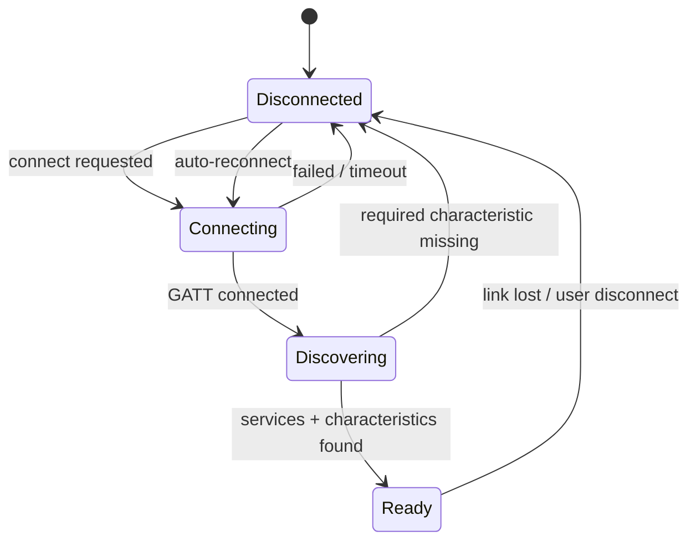
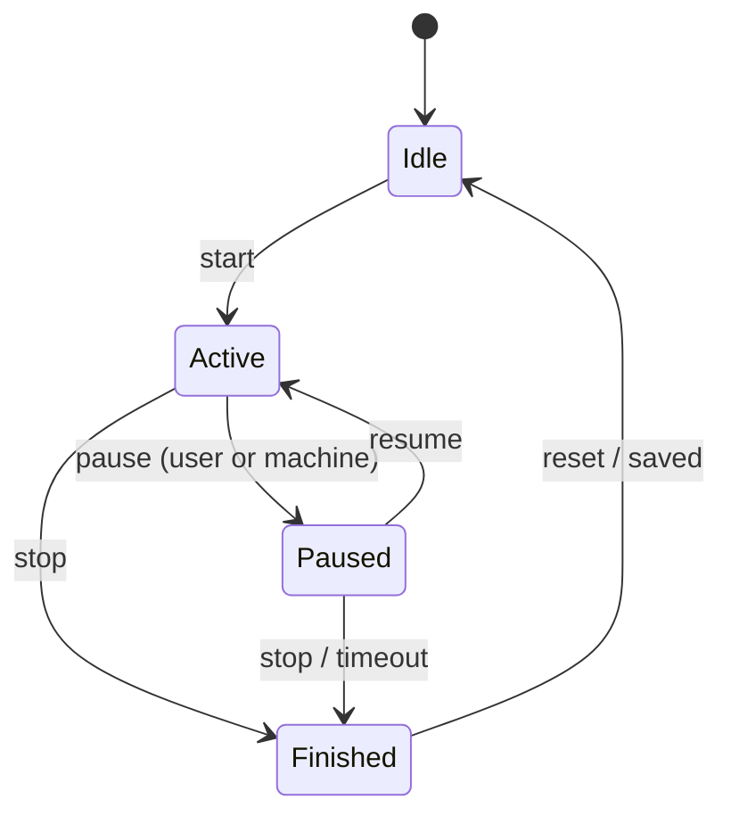

# MyHi Companion — Project Plan

> Personal Android companion app for the MY-HI Q8Y treadmill over Bluetooth FTMS.
> Plan version 2.1 — updated 2026-07-28 with partial probe results.
> Supersedes the original phase list.

**v2.1 changes** (from the first nRF Connect capture — see `DEVICE.md`):
- Device identified as a **FitShow BLE module**, not a MY-HI-native implementation.
  FTMS is a vendor shim over a transparent UART bridge. Expect spec deviations.
- **`0x2ACC` feature flags proven unreliable** — the device claims incline target
  setting on a machine with no incline. Downgraded to advisory; Phases 4 and 6 now
  derive capability from observed behaviour instead.
- **`180D` Heart Rate Service found** — likely a better HR source than the FTMS field.
- **minSdk resolved: 31, target 36.** Legacy Bluetooth permission path deleted.
- **Phase 8 gains a HyperOS checklist.** Standard Android battery-optimisation is not
  sufficient on Xiaomi.
- Speed range 1.0–16.0 km/h **confirmed correct** — v2.0's scepticism about that
  figure was wrong; this is a full folding treadmill.

---

## How to read this document

This plan is written to be handed to an implementing agent (Claude Sonnet) working
in a repository, with a human operator (the project owner) who has physical access
to the treadmill.

**Division of labour is not optional and must be respected:**

| Actor | Can do | Cannot do |
|-------|--------|-----------|
| Implementing agent | Write code, write tests, write docs, run unit tests | Connect to Bluetooth, observe the treadmill, verify live metrics |
| Human operator | Run the app on a device, walk on the treadmill, capture logs, report observations | — |

Any task whose acceptance depends on observing real hardware is marked
**`[HUMAN]`**. The agent must stop at those points and request results rather than
assuming them.

Any value in this plan or in `05-FTMS-Protocol.md` marked **`TBD`** is unknown until
measured on the real device. **The agent must not invent a value for a `TBD` field.**
If a `TBD` blocks progress, the correct action is to make it configurable, read it
from the device at runtime, or stop and ask.

---

## Vision

Replace FitShow for daily use with something meaningfully better.

- Connect directly to the treadmill over Bluetooth FTMS
- Display live workout metrics
- Control treadmill speed
- Record workout history, including per-workout telemetry
- Charts and statistics
- Work reliably in Android split screen alongside video apps
- Survive screen lock via a foreground service
- Fully offline; no account, no network calls

**Non-goals** (write these down so they don't creep in): cloud sync, social features,
multi-user, iOS, Strava/Garmin export, training plans, coaching.

---

## Technology stack

| Component | Choice | Licence | Note |
|-----------|--------|---------|------|
| Framework | .NET MAUI (Android only) | MIT | Single target keeps conditional compilation out |
| Language | C# / .NET 9 | MIT | |
| Bluetooth | Android BLE APIs via MAUI platform code | — | See BLE library decision below |
| Protocol | Bluetooth FTMS (service `0x1826`) | — | |
| Database | SQLite (`sqlite-net-pcl` or `Microsoft.Data.Sqlite`) | MIT | See decision below |
| Charts | LiveCharts2 | MIT | |
| MVVM | CommunityToolkit.Mvvm | MIT | |
| File dialogs | CommunityToolkit.Maui | MIT | `FileSaver`, `FilePicker` |
| Logging | Microsoft.Extensions.Logging | MIT | |
| DI | Built-in MAUI DI | MIT | |

All dependencies must be MIT / Apache-2.0 / BSD. No GPL, no commercial-licence
packages, no "free for personal use" terms.

### Open stack decisions

**BLE access layer.** Two options:

- **`Plugin.BLE`** (MIT) — cross-platform abstraction, less boilerplate, mature.
  Cost: an abstraction between you and `BluetoothGatt`, which is exactly the layer
  where Android BLE bugs live. Its threading and reconnect semantics are its own,
  and debugging through it is harder.
- **Direct Android bindings** (`Android.Bluetooth.*` in the MAUI Android platform
  folder) — full control, no dependency, every Android quirk is directly
  addressable. Cost: several hundred lines of callback plumbing you write and
  maintain yourself.

**Recommendation: `Plugin.BLE`.** This is a single-device, single-platform personal
app; the abstraction cost is low and the boilerplate saving is real. Revisit only if
you hit a reconnect or threading bug you cannot reach through the plugin.
*Confidence: moderate — this is a judgement call, not a fact.*

**SQLite library.** `sqlite-net-pcl` is simpler (attribute-mapped ORM, less code).
`Microsoft.Data.Sqlite` is closer to raw ADO.NET and gives you real control over
transactions and bulk inserts — which matters for the telemetry sample writes in
Phase 7. **Recommendation: `Microsoft.Data.Sqlite`**, given you're already fluent in
ADO.NET-style data access and the sample table is the performance-sensitive part.

---

## Development rules

Every phase must:

- Compile with zero warnings
- Pass all prior phase tests (regression)
- Include the documentation listed in its Deliverables
- Have every `[HUMAN]` test executed and recorded before the phase is closed

No phase begins until the previous phase's acceptance criteria are met.

**Additional rule for this revision:** any assumption an implementer makes to get
unblocked must be written into `docs/ASSUMPTIONS.md` with the phase number, and
resolved before the phase closes.

---

## What changed from plan v1, and why

| Change | Reason |
|--------|--------|
| Phase 3 is now **Protocol Discovery**, not "read every characteristic" | The device's actual behaviour is unknown. Its deliverable is a hex-dump diagnostic screen + a filled-in protocol doc, not a feature. |
| Phase 3 also delivers a **fake treadmill service** | Decouples Phases 4–7 from having the hardware in the room. Roughly 40 lines, saves the whole project. |
| Phase 7 adds **`WorkoutId` GUID** and a **`WorkoutSample` table** | Portable identity is required for any backup/restore. Telemetry is required for per-workout charts. Both are schema changes and get cheaper the earlier they land. |
| **Foreground Service moved earlier** (Phase 8) | Every long-running test from Phase 7 onward is unreliable without it. |
| **Backup split**: minimal at Phase 10, polish deferred to Phase 16 | Protects data during the schema-churn phases without spending a week on merge/CSV/migration before anything is proven. |
| **Merge mode cut** from v1 backup | Cost is 4× the test matrix and invented conflict semantics; benefit is a rare scenario. The GUID keeps the door open. |
| **Connection and workout state machines separated** | The original single diagram could not express "connection lost mid-workout", which is the most likely real failure. |
| Original "Phase 13 — Backup" collision resolved | v1 had two Phase 13s. |

---

## Phase overview

| # | Phase | Hardware needed | Rough size |
|---|-------|-----------------|------------|
| 0 | Project initialisation | No | S |
| 1 | Bluetooth discovery | **Yes** | S |
| 2 | Device connection | **Yes** | M |
| 3 | FTMS protocol discovery | **Yes** | L |
| 4 | Live dashboard | No (fake service) | M |
| 5 | Workout engine | No (fake service) | M |
| 6 | Treadmill control | **Yes** | M |
| 7 | Workout recording + schema | No (fake service) | M |
| 8 | Foreground service | **Yes** | M |
| 9 | Settings | No | S |
| 10 | Backup (minimal) | No | M |
| 11 | Statistics | No | M |
| 12 | Split screen | No | M |
| 13 | Performance | **Yes** | S |
| 14 | UI polish | No | M |
| 15 | Endurance testing | **Yes** | M |
| 16 | Backup polish (optional) | No | M |

---

# Phase 0 — Project Initialisation

## Goal
Project foundation, buildable and running.

## Tasks
- MAUI Android-only project, .NET 9, **`minSdkVersion` 31, `targetSdkVersion` 36**
- DI container wiring, logging to logcat + a rolling file
- Feature-folder structure (`Features/Bluetooth`, `Features/Workout`, …)
- Dark theme
- Shell navigation
- SQLite connection factory + migration runner (empty migration set)
- Git repository, `.gitignore`, initial commit

**Min SDK — RESOLVED (was `TBD` in v2.0).** The target device is a Poco X6 Pro 5G on
Android 16 / API 36, and it is a dedicated device with no other users. Set min SDK 31
(Android 12) and target 36.

This deletes work rather than adding it: the entire legacy Bluetooth permission path
(`BLUETOOTH`, `BLUETOOTH_ADMIN`, `ACCESS_FINE_LOCATION`) is out of scope. Do not
implement it "just in case" — it is dead code on this device and an extra permission
prompt for no benefit.

## Deliverables
Running app, home page, dark theme, logging, navigation, migration runner.

## Tests
- Build produces zero warnings
- App launches, home page renders
- Log file is written and retrievable
- Migration runner creates an empty database file on first run

## Acceptance
Clean build, clean launch, database file created.

---

# Phase 1 — Bluetooth Discovery

## Goal
Find the treadmill.

## Features
- Runtime permission requests (see permission matrix below)
- Bluetooth adapter state detection + prompt to enable
- Start/stop scan, with a scan timeout (30 s default)
- Device list: name, MAC, RSSI, live-updating, de-duplicated by MAC
- Filter toggle: "FTMS devices only" (filter on service UUID `0x1826`)

## Permissions — modern path only (minSdk 31)

```xml
<uses-permission android:name="android.permission.BLUETOOTH_SCAN"
                 android:usesPermissionFlags="neverForLocation" />
<uses-permission android:name="android.permission.BLUETOOTH_CONNECT" />
```

`neverForLocation` is correct here — the app never derives location from scan results —
and avoids the location permission prompt entirely. No legacy permission path.

## Scan filtering

Primary: filter on service UUID `0x1826`.

**Fallback:** the device advertises as `FS-9F4235` (a FitShow module; the `FS-` prefix
is the vendor). If `0x1826` turns out not to be present in the advertisement packet,
match on the `FS-` name prefix instead. **`TBD` — confirm which, via nRF Connect.**

Do not ship both filters active simultaneously; pick the one that works and document
why in `DEVICE.md`.

## Known Android pitfalls to handle
- **Scan throttling:** Android limits an app to ~5 scan starts per 30-second window.
  Rapid start/stop cycling silently stops returning results with no error. Debounce
  the scan button and never auto-restart scanning in a tight loop.
- Scanning with no filter and no service UUID is slower and drains more battery.
- If the treadmill does not advertise `0x1826` in its advertisement packet, the
  service-UUID filter will find nothing. **`TBD` — verify.** Fall back to the `FS-`
  name prefix, not to unfiltered scanning.
- RSSI at the walking position is approximately −49 dBm — a strong signal. Range is
  not expected to be a problem, which makes any disconnect a software issue rather
  than a radio one. Useful diagnostic framing for Phase 2.

## Tests
| Test | Expected | |
|------|----------|---|
| Bluetooth disabled | Clear prompt to enable, no crash | |
| Permission denied | Explanatory message + link to app settings | |
| Scan with treadmill on | MY-HI device appears within 10 s | `[HUMAN]` |
| Walk away ~10 m | RSSI value decreases | `[HUMAN]` |
| Treadmill powered off | Device disappears after timeout | `[HUMAN]` |
| Scan 3× in succession | No duplicate rows; results still returned | `[HUMAN]` |
| FTMS filter on | Treadmill still appears (or filter proven useless) | `[HUMAN]` |

## `[HUMAN]` deliverable
Record in `docs/DEVICE.md`: advertised device name, MAC address, whether `0x1826`
appears in the advertisement, typical RSSI at the walking position.

## Acceptance
Treadmill reliably discovered across 5 consecutive scans. No crash on any permission
or adapter state.

---

# Phase 2 — Device Connection

## Goal
Stable GATT connection with automatic recovery.

## Features
- Connect / disconnect
- Service and characteristic discovery
- Remember last device (MAC) in preferences
- Auto-reconnect with exponential backoff (1 s, 2 s, 4 s, 8 s, 16 s, then 30 s
  steady), cancellable, and capped — do not retry forever with the screen off
- Connection state surfaced to UI

## Connection state machine



This machine is **independent of the workout state machine** (Phase 5). Both run
concurrently.

## Known Android pitfalls to handle
- **GATT error 133** is the single most common Android BLE failure. It is generic
  and can mean almost anything. Mitigations that are known to help: always call
  `close()` on the `BluetoothGatt` before reconnecting (not just `disconnect()`);
  connect with `autoConnect: false` for the first attempt; add a short delay
  (~200 ms) between connect and `discoverServices()`.
  *Confidence: high that 133 will occur; moderate on which mitigation fixes it for
  this device — treat as empirical.*
- Discovering services immediately on connect can fail on some stacks. Delay.
- Do not issue GATT operations from arbitrary threads; serialise them.
- Bonding: **RESOLVED — not required.** No pairing prompt was observed during the
  first capture. Do not implement bond-state handling.

## Tests
| Test | Expected | |
|------|----------|---|
| Connect | Reaches `Ready` within 10 s | `[HUMAN]` |
| Disconnect | Clean teardown, no leaked GATT | `[HUMAN]` |
| Walk out of range and return | Auto-reconnects | `[HUMAN]` |
| Toggle phone Bluetooth off/on | Recovers to `Ready` | `[HUMAN]` |
| App restart | Reconnects to remembered device | `[HUMAN]` |
| Treadmill power-cycled | Reconnects once powered on | `[HUMAN]` |
| Hold connection 30 min idle | No spontaneous drop | `[HUMAN]` |

## Acceptance
Connects on 10 of 10 attempts. Recovers from all four disruption tests.

---

# Phase 3 — FTMS Protocol Discovery

> **This is the most important phase in the project and the one most likely to be
> done badly.** Its purpose is not to build a feature. Its purpose is to replace
> every `TBD` in `05-FTMS-Protocol.md` with a measured fact.

## Goal
Determine exactly how this specific treadmill behaves, and encode it.

## What the first capture already told us

The device advertises as `FS-9F4235` and exposes `FFE0` and `FFF0` alongside `1826`.
`FS-` is FitShow (Xiamen) Information Technology, who make transparent-UART BLE
modules for treadmills, bikes and rowers. The architecture is:

```
treadmill motor board ←UART→ FitShow BLE module ←BLE→ phone
                                   │
                                   ├── FFE0 / FFF0  transparent serial (what the
                                   │                 FitShow app actually uses)
                                   └── 1826         FTMS shim layered on top
```

**Two consequences that shape this phase:**

1. **FTMS here is a vendor shim, not a native implementation.** A shim written once
   for an entire product line is exactly where spec deviations live. Assume nothing;
   verify everything against hex.
2. **The vendor protocol is not a viable fallback.** The FitShow UART protocol is
   undocumented and prior attempts to decode it have not produced public results.
   Record `FFE0`/`FFF0` in `DEVICE.md` for completeness and do not plan around them.
   If FTMS turns out to be unusable, that is a project-level decision, not a
   workaround to attempt mid-phase.

## Capability detection strategy — CHANGED in v2.1

**`0x2ACC` is advisory. Do not gate features on it.**

The captured feature flags claim Resistance Level and Power Measurement — neither of
which a treadmill has — and claim **Inclination Target Setting on a machine with no
incline**, while inclination is absent from the machine-features word. That internal
contradiction is direct evidence of a stock bitmask baked into module firmware rather
than a description of this treadmill.

Required approach instead:

- **Dashboard fields:** accumulate the union of observed `0x2ACD` flag bits over the
  first ~30 seconds after connecting. A field is real if it appears in packets. Log
  `0x2ACC` for reference; do not branch on it.
- **Speed control:** gate on the actual control point response, not on the Speed
  Target Setting bit. If `Request Control` or `Set Target Speed` returns anything
  other than `0x01`, disable the controls permanently for the session and log it.
- Persist the derived capability set per device so the UI isn't rebuilding itself on
  every connect.

## Heart rate — two sources, prefer the dedicated service

The device exposes standard Heart Rate Service `180D` **and** sets the FTMS heart rate
feature bit. Prefer `0x2A37` (Heart Rate Measurement) from `180D`: a simple dedicated
characteristic is far less likely to be mangled by a shim than a conditionally-present
field inside a flag-driven record. Fall back to the FTMS field only if `180D` is dead.

Handgrip sensors only produce data while gripped, and are noisy when they do.
**If the capture shows sparse or implausible values, cut heart rate from the dashboard
and charts entirely** rather than shipping a metric you won't trust.

## Deliverables

1. **Diagnostic screen** — a developer screen that:
   - Lists every discovered service and characteristic with its properties
   - Dumps the raw value of every `Read` characteristic as hex
   - Logs every notification/indication as `timestamp | uuid | hex bytes`
   - Streams to both screen and log file
   - Has a "copy log" / "share log" button
2. **Parsers** — flag-driven decoders for `0x2ACD`, `0x2ACC`, `0x2AD4`, `0x2ADA`,
   `0x2AD3`, the control point response format, and `0x2A37` (Heart Rate Measurement
   from `180D`). See `05-FTMS-Protocol.md` for byte layouts.
3. **Unit tests for the parsers** using captured hex from step 4 as fixtures. These
   are the only meaningful automated tests in the project — write them properly.
4. **`[HUMAN]` capture session** — run the probe procedure in
   `05a-FTMS-Probe-Procedure.md` and paste results back.
5. **`ITreadmillService` implementation** + **`FakeTreadmillService`** (see
   `contracts/ITreadmillService.cs`). The fake replays a canned sample stream so
   Phases 4, 5, 7 can be built and tested without the treadmill.
6. **Updated `05-FTMS-Protocol.md`** with all `TBD` values filled in.

## Critical implementation requirements

These are the errors that will otherwise be made. They are drawn from the FTMS 1.0
specification and are not negotiable:

- **Treadmill Data flags bit 0 is inverted.** Instantaneous Speed is present when
  bit 0 (`More Data`) is **0**. Decoding this as a normal presence bit shifts every
  subsequent field and corrupts the whole packet.
- **Total Distance is uint24** (3 bytes, little-endian), not uint16.
- **Expended Energy is one flag bit but three fields** (uint16 + uint16 + uint8 =
  5 bytes).
- **Parsers must be cursor-based and flag-driven, never fixed-offset.**
- **Parsers must validate length**: if the byte count does not match the sum of the
  flagged field widths, reject the packet and log it. Do not read past the buffer.
- **`Request Control` (opcode `0x00`) must be written and acknowledged before any
  other control point command**, and re-issued after every reconnect. Omitting it is
  the most common cause of "set speed does nothing".
- **Subscribe to indications on the control point (`0x2AD9`) before writing to it.**
- **Serialise control point writes** — one outstanding command, wait for the
  indication (3 s timeout) before sending the next.

## Tests
- Parser unit tests against captured hex fixtures, including malformed packets
- `[HUMAN]` Compare decoded speed / distance / calories / time against the treadmill
  console and against FitShow, at three different speeds
- `[HUMAN]` Confirm notification rate (expected ~1 Hz; the FTMS spec recommends once
  per second and the original plan's "5–10/sec" figure is probably wrong)

## Acceptance
- Every `TBD` in `05-FTMS-Protocol.md` is resolved or explicitly marked
  "not supported by this device"
- Decoded values match the treadmill console within rounding at three speeds
- Parser unit tests pass, including malformed-input cases
- `FakeTreadmillService` produces a realistic 10-minute sample stream

---

# Phase 4 — Live Dashboard

## Goal
Display live metrics, smoothly, without blocking.

Built against `ITreadmillService` — develop and test with `FakeTreadmillService`,
verify with hardware at the end.

## Features
- Speed, distance, calories, elapsed time, heart rate (if usable), machine status
- Connection indicator
- Fields the device does not actually send are **hidden, not shown as `--`**

**Field visibility comes from observed `0x2ACD` flags, not from `0x2ACC`** (see
Phase 3). The feature bitmask on this device is known to over-claim.

Heart rate comes from `0x2A37` / `180D` if usable, from the FTMS field if not, and is
removed from the UI entirely if neither produces trustworthy data.

## Implementation requirements
- Marshal notification callbacks to the UI thread once, at the service boundary
- Throttle UI updates to at most 4 Hz even if notifications arrive faster
- Never allocate per notification in the hot path more than necessary; the parser
  should write into a struct

## Tests
- Fake service: 10-minute stream renders continuously, no frozen UI
- `[HUMAN]` Walk 5 minutes; every field updates and matches the console
- `[HUMAN]` Rotate device mid-workout; no crash, no reset

## Acceptance
Smooth updates for 10 minutes with no UI stall.

---

# Phase 5 — Workout Engine

## Goal
Workout lifecycle, independent of connection lifecycle.

## Workout state machine



## Connection-loss policy (decide and document)

**Recommended:** on connection loss during `Active`, transition to `Paused` and start
a 60-second grace timer. If the connection is restored within the window, resume. If
not, transition to `Finished` and save what was recorded.

The gap must be represented explicitly in the sample series — record a marker rather
than interpolating across it, so charts show a break instead of a fabricated
straight line.

## Counter semantics — depends on a Phase 3 finding

**`TBD` — do the treadmill's distance/calories/time counters reset per session, or
accumulate since power-on?**

- If **per-session**: record reported values directly.
- If **cumulative**: every workout value is a delta against the value captured at
  workout start, and the engine must detect a mid-workout counter reset (value
  decreases) and re-baseline.

The implementer must handle whichever Phase 3 established. Do not guess.

## Tests
- Every state transition exercised, including illegal ones (must be rejected, not
  crash)
- Connection loss during `Active` → grace → resume
- Connection loss during `Active` → grace expiry → `Finished` with data saved
- `[HUMAN]` Press pause on the treadmill itself; app reflects it via `0x2ADA`

## Acceptance
No illegal state reachable. Connection loss never loses more than the grace window.

---

# Phase 6 — Treadmill Control

## Goal
Change treadmill speed from the app, reliably.

## Features
- Increase / decrease by the device's minimum increment (0.1 km/h)
- Preset speed buttons, **generated from the device's supported range** (1.0–16.0
  km/h as read from `0x2AD4`), not hardcoded
- Stop

**Control availability is decided by behaviour, not by the feature bit** (changed in
v2.1). The `Speed Target Setting` bit is set on this device, but the same bitmask also
claims incline support on a machine with no incline, so it carries little weight.

Gate on the live handshake instead:
1. `0x2AD9` was discovered
2. `Request Control` (`0x00`) returned `0x01`
3. The first `Set Target Speed` returned `0x01`

If any step fails, disable speed controls for the session, log the result code, and
show the user a plain explanation. **`TBD` — whether this device honours the control
point at all is still unverified (Probe Part D).** Phase 6 may turn out to be void,
which is a valid finding.

## Implementation requirements
- **Debounce and coalesce.** Rapid +/- taps must produce one write of the final
  target, not one write per tap. Suggested: 300 ms debounce.
- Clamp target to the range read from `0x2AD4`; round to the device's increment
- Surface control point failures to the user with the actual result code meaning
  (`Control Not Permitted` and `Invalid Parameter` need different messages)
- Re-issue `Request Control` after reconnect before enabling controls
- Optimistic UI is acceptable but must reconcile against the next `0x2ACD`
  notification and revert if the machine did not comply

## Safety note
"Emergency Stop" was in the original plan. **Do not name it that.** A Bluetooth stop
command over an unreliable link is not an emergency stop; the physical safety key is.
Call it "Stop" and state in the UI that the safety key is the emergency stop. This is
a real safety concern, not pedantry.

## Tests
| Test | Expected | |
|------|----------|---|
| Increase speed | Belt actually speeds up | `[HUMAN]` |
| Decrease speed | Belt slows | `[HUMAN]` |
| Rapid 10× tap on + | One write; final speed correct | `[HUMAN]` |
| Set speed below minimum | Clamped, no error | |
| Set speed above maximum | Clamped, no error | |
| Stop | Belt stops | `[HUMAN]` |
| Control without Request Control | Fails gracefully with a clear message | |
| Set speed after reconnect | Works (control re-requested) | `[HUMAN]` |

## Acceptance
20 consecutive speed changes succeed. No command sent outside the device's range.

---

# Phase 7 — Workout Recording & Schema

## Goal
Persist workouts and telemetry durably.

See `14-Database.md` for the full schema. Summary of the two decisions that matter:

- **`Workout.Id`** is `INTEGER PRIMARY KEY AUTOINCREMENT` — local, physical, used for
  joins.
- **`Workout.WorkoutId`** is a `TEXT` GUID, `UNIQUE`, generated at workout creation —
  the portable identity used by backup/restore. Integer PKs are not portable across
  devices and must never be used for de-duplication.
- **`WorkoutSample`** stores telemetry at a **fixed 5-second cadence**
  (~720 rows/hour, ~9 MB/year at 250 workouts/year). Fixed cadence beats on-change
  because heart rate varies continuously, so on-change degenerates to per-sample
  anyway while adding interpolation logic on the read side.

## Implementation requirements
- **Buffer samples in memory and flush every 30–60 s inside a single transaction.**
  Do not insert per sample — 720 individual transactions per workout is needless
  battery and flash wear. Worst-case crash loses under a minute.
- Flush on pause, on finish, and on `OnSleep`
- Write the workout header row at workout start (state = in-progress), not at the
  end, so a crash leaves a recoverable partial workout
- On app start, detect and either recover or discard workouts left in-progress

## Tests
- 10 workouts via fake service, restart, all present with correct sample counts
- Kill the app mid-workout; on restart the partial workout is handled per policy
- Sample write throughput: 1 hour of samples inserts in under 1 s
- `[HUMAN]` One real 20-minute workout; summary matches the treadmill console

## Acceptance
No data loss across app restart. Sample cadence correct within ±1 s.

---

# Phase 8 — Foreground Service

> Moved earlier than in plan v1. Every long-running test from here on is unreliable
> without it, and the split-screen use case (app visible but not focused) is exactly
> where Android starts restricting background work.

## Goal
Keep BLE alive and recording while the screen is off or the app is unfocused.

## Features
- Foreground service started when a workout starts, stopped when it ends
- Persistent notification showing elapsed time, distance, speed
- Notification actions: pause / stop
- BLE connection and sample recording owned by the service, not the UI

## Implementation requirements
- `foregroundServiceType="connectedDevice"` in the manifest **and** the
  `FOREGROUND_SERVICE_CONNECTED_DEVICE` permission. Since Android 15 a generic
  foreground service is no longer sufficient for background BLE, and the failure mode
  is a *silent* scan failure rather than an exception — easy to misdiagnose for hours.
- Pass the type constant to `startForeground()` as well as declaring it.
- `POST_NOTIFICATIONS` runtime permission.
- Start the service only from a user-visible action (the Start button). Never from the
  background, never from `BOOT_COMPLETED`.
- The service is the single owner of the BLE connection; the UI binds to it.

**Good news on timeouts:** the 6-hour foreground service limit introduced in Android 15
applies only to `dataSync` and `mediaProcessing`. `connectedDevice` is not subject to
it, so a two-hour workout is fine and no `onTimeout()` handling is needed.
*Confidence: high — current Android documentation.*

## Xiaomi / HyperOS setup checklist — `[HUMAN]`

The target device is a Poco X6 Pro 5G on HyperOS. **Standard Android battery
optimisation being disabled is not sufficient.** HyperOS has additional per-app
controls that are the ones that actually kill long-running services:

- [ ] **Autostart** enabled for the app (separate HyperOS menu)
- [ ] App's **Battery saver** set to **"No restrictions"** (HyperOS's own setting in
      app info, distinct from Android's battery optimisation toggle)
- [ ] App **locked in Recents** (padlock in the task switcher) to resist memory reclaim
- [ ] Android battery optimisation disabled (already confirmed done)

*Confidence: high that these controls exist and matter on Xiaomi; moderate on the exact
menu names, which Xiaomi renames between HyperOS versions.*

**Verify every box before running Phase 15.** If skipped, endurance tests will fail for
reasons unrelated to the code, and the resulting debugging will be wasted.

The app should still **prompt and explain** rather than requiring these — but on this
specific device they are effectively mandatory, so record their state in `DEVICE.md`.

## Tests
| Test | Expected | |
|------|----------|---|
| Lock phone, walk 10 min | No disconnect, samples continuous | `[HUMAN]` |
| Switch to YouTube 10 min | No disconnect | `[HUMAN]` |
| Notification pause/stop | Works, UI reflects it | `[HUMAN]` |
| Swipe app from recents mid-workout | Service survives, or workout saved cleanly | `[HUMAN]` |
| 60-minute locked walk | Zero disconnects, sample gaps < 5 s | `[HUMAN]` |

## Acceptance
One-hour locked workout with no disconnect and no sample gap over 5 seconds.

---

# Phase 9 — Settings

## Goal
User preferences, persisted.

## Storage decision
Scalar settings live in **MAUI `Preferences`** (Android `SharedPreferences`), not
SQLite. Synchronous access, no async ceremony in ViewModels, no database hit at
startup for six booleans.

**Exception:** *Saved Devices* is a collection with a lifecycle and lives in SQLite.

## Settings
| Setting | Store | Default |
|---------|-------|---------|
| Auto-reconnect | Preferences | true |
| Keep screen awake during workout | Preferences | true |
| Dark mode | Preferences | system |
| Units (metric/imperial) | Preferences | metric |
| Voice announcements | Preferences | off |
| Dashboard layout | Preferences (JSON string) | default |
| Saved devices | SQLite | — |

## Tests
- Change every setting, force-stop, relaunch, all persist
- Units toggle converts displayed values without corrupting stored data
  (**store metric always; convert at display time only**)

## Acceptance
All settings survive force-stop. No unit conversion ever touches the database.

---

# Phase 10 — Backup (minimal)

> Deliberately scoped down from plan v1. Merge mode, CSV, and version migration are
> deferred to Phase 16. This phase exists to make data loss survivable, nothing more.

## Goal
Get workout history off this phone and onto another one.

## Scope — in
- Full export to a single ZIP
- Import, **Replace mode only**
- Automatic local backup on workout finish (last 5 kept, app-private storage)
- Pre-import safety backup

## Scope — out (Phase 16)
- Merge mode
- CSV export
- Backup format version migration (the *mechanism* ships here; migrations do not)
- Statistics/PR export — these are **derived from workouts and must be recomputed on
  import**, never exported. Exporting derived data creates two sources of truth.

## Backup contents

```
MyHiBackup_2026-07-28_1930.zip
├── manifest.json     (backup format version, app version, export date, counts)
├── workouts.json     (workout headers, keyed by WorkoutId GUID)
├── samples.json      (telemetry, keyed by WorkoutId GUID)
├── devices.json
└── settings.json
```

One manifest file, not the `metadata.json` + `version.json` pair from plan v1 — two
files with overlapping responsibility drift apart.

`manifest.json` carries **`backupFormatVersion` as an integer, independent of the app
version.** A UI bugfix bumping the app version must not invalidate backups.

## Transfer mechanism

- **Export: share sheet.** Build the ZIP in `FileSystem.CacheDirectory`, then
  `Share.Default.RequestAsync(new ShareFileRequest(...))`. Zero storage permissions
  (goes through FileProvider, which MAUI wires up), one tap to Drive/Gmail/Nearby
  Share, and it sidesteps scoped storage entirely.
- **Optional secondary:** "Save to device" via `CommunityToolkit.Maui` `FileSaver`.
  Be aware `FileSaver` has a history of permission failures on API 33+ and of
  returning unresolvable `content://` paths when the user picks a cloud provider.
  Keep it as a secondary button, not the primary path.
- **Import:** `FilePicker.Default.PickAsync`. **MIME filtering for ZIP is
  inconsistent** across Android file providers (`application/zip`,
  `application/octet-stream`, `*/*`). Accept broadly and validate by reading the
  archive header, not the extension.
- **Do not** hardcode `Documents/MyHi Companion/Backup/`. Since Android 10 scoped
  storage, an app cannot freely create and write that path.

## Safety requirements — these are the point of the phase

- **Replace must not be destructive on failure.** Plan v1 said "delete current data,
  then restore" — if that throws at file 3 of 5 the user has neither. Required:
  1. Write an automatic pre-import backup to app-private storage first
  2. Perform the entire data import inside **one SQLite transaction**
  3. Apply settings **after** the transaction commits — `Preferences` sits outside
     the transaction, and losing six toggles is recoverable while losing years of
     workouts is not
  4. Offer "undo last import" for one session
- **Atomic export:** write to `.tmp`, then rename. An interrupted export must not
  leave a truncated file with a valid-looking name.
- **Zip-slip guard:** reject any archive entry whose name is not in the known
  filename allowlist. Three lines, closes an entire bug class.
- **Decompression cap:** reject archives whose uncompressed size exceeds a limit
  (say 500 MB).
- **Streaming import.** With telemetry included, backups reach tens of MB. Do not
  deserialise the whole document into memory.
- **Block export during an active workout** and **block import while connected or
  mid-workout.**
- **Timestamps are UTC plus stored offset**, serialised as ISO 8601 with offset.
  Local-time-without-offset shifts every daily/weekly bucket when restored in another
  timezone — or just across a DST boundary.
- **Restored saved devices will not auto-connect** on a new phone: the MAC restores
  but the bond does not. Tell the user they'll need to reconnect once, rather than
  letting it look broken.

## Tests
| Test | Expected |
|------|----------|
| Export with 50 workouts | ZIP created, opens, contains all five files |
| Export → wipe → import | Row counts match **and** SHA-256 of a canonically-ordered dump matches |
| Kill app mid-import | No data loss; pre-import backup recoverable |
| Import corrupt ZIP | Clear error, existing data untouched |
| Import archive with `../` entry | Rejected |
| Import backup with newer format version | Clear "created by a newer version" message |
| Export during active workout | Blocked with explanation |
| Auto-backup after 6 workouts | Exactly 5 files retained, oldest rotated out |

## Acceptance
The export→wipe→import checksum test passes. No test leaves the database in a
partial state. "No data loss" is measured by checksum, not by eyeballing a list.

---

# Phase 11 — Statistics

## Goal
Aggregates and charts.

## Features
- Daily / weekly / monthly / yearly aggregates
- Personal records (longest distance, longest duration, fastest average)
- Cross-workout charts: distance, calories, duration, average speed over time
- **Per-workout charts** — speed and heart rate curves from `WorkoutSample`. This is
  the payoff for storing telemetry and the main thing FitShow does badly.

## Implementation requirements
- **Statistics and PRs are always computed from `Workout`/`WorkoutSample`, never
  stored.** If a query becomes slow, cache it in a table that is explicitly
  rebuildable, and rebuild it after any import.
- Aggregate in SQL, not in C# over a full table read
- Index `Workout(StartedAtUtc)` — every aggregate query filters on it
- Downsample sample series for display; a 2-hour workout is 1,440 points and
  LiveCharts2 does not need all of them for a 400 px chart

## Tests
- Hand-calculate weekly totals for a seeded dataset and compare
- Timezone: a workout at 23:30 local buckets into the correct local day
- DST boundary week aggregates correctly
- Empty dataset renders without crashing
- 5,000-workout dataset: aggregate queries under 200 ms

## Acceptance
Manual calculations match for daily, weekly, monthly. No stored derived values.

---

# Phase 12 — Split Screen

## Goal
Usable alongside YouTube.

## Features
- Responsive layout at 33% / 50% / 75% / full
- Compact dashboard variant below a height threshold
- `android:resizeableActivity="true"`, correct `configChanges` handling

## Implementation requirements
- Handle configuration changes without recreating the BLE connection — the service
  owns it (Phase 8), so this should already hold; verify it does
- Speed controls must remain reachable at 33% height — this is the real constraint

## Tests
| Test | | |
|------|---|---|
| Each of 4 sizes, portrait and landscape | Controls reachable and tappable | `[HUMAN]` |
| Resize mid-workout | No disconnect, no data gap | `[HUMAN]` |
| YouTube / Messenger / Chrome as the other pane | Dashboard keeps updating | `[HUMAN]` |

## Acceptance
Fully usable at 33% with no disconnect on resize.

---

# Phase 13 — Performance

## Goal
Measure, then fix what's actually slow.

## Measure
- Memory over a 1-hour workout (target: under 150 MB, and **flat** — the slope
  matters more than the absolute number)
- CPU during active recording
- Battery drain per hour of workout
- BLE notification-to-UI latency
- Sample flush duration
- Statistics query time at 1,000 and 5,000 workouts

## Tests
- `[HUMAN]` One-hour workout with the profiler attached
- Memory graph is flat, not rising — a rising graph means the sample buffer or an
  event subscription is leaking
- Seeded 5,000-workout database: every screen opens in under 500 ms

## Acceptance
Flat memory over one hour. Statistics queries under 200 ms at 5,000 workouts.

---

# Phase 14 — UI Polish

## Tasks
- App icon, splash
- Typography scale, consistent spacing
- Loading and empty states for every screen
- Error messages that say what to do, not what failed
- Accessibility: content descriptions, minimum 48 dp touch targets, contrast check
- Haptics on speed change confirmation

## Tests
- Every screen reviewed in light and dark, at 33% and full width
- TalkBack pass over the dashboard and controls
- Font scale at 200% does not break layouts

## Acceptance
Release candidate.

---

# Phase 15 — Endurance Testing

> All `[HUMAN]`. This is the phase that decides whether the app is actually better
> than FitShow.

| # | Test | Pass condition |
|---|------|----------------|
| 1 | 60-minute walk, screen locked | No disconnect, no sample gap > 5 s |
| 2 | 120-minute walk | Same, plus flat memory |
| 3 | Split screen, switching YouTube / Messenger / Chrome throughout | No disconnect |
| 4 | Lock/unlock 20× during a workout | No disconnect, no duplicate samples |
| 5 | Disable Bluetooth mid-workout, re-enable | Grace-window resume works |
| 6 | Power treadmill off mid-workout, back on | Workout finishes cleanly or resumes per policy |
| 7 | Force-close app mid-workout, relaunch | Partial workout recovered, no data loss |
| 8 | Export → factory-reset-equivalent (uninstall/reinstall) → import | Full history restored, checksum match |
| 9 | Seven consecutive daily workouts | History, stats, and PRs all correct |

## Acceptance
All nine pass. Test 8 is the one that validates the entire backup phase.

---

# Phase 16 — Backup Polish (optional)

Only if Phases 0–15 are done and the app is in daily use.

- CSV export of workout summaries (**export-only, not round-trippable** — say so in
  the UI). Two correctness requirements: write a **UTF-8 BOM** or Excel mangles
  non-ASCII, and use invariant culture for numbers with a documented note, since
  Excel parses CSV using the OS list separator and comma-decimal locales will split
  `12.5` into two columns.
- Merge import mode. Now cheap because `WorkoutId` exists — `INSERT OR IGNORE` on the
  GUID. Still needs a 4-case test matrix (empty / disjoint / partial overlap / full
  overlap) and defined conflict semantics for same-GUID-different-data.
- Backup format migration for older `backupFormatVersion` values, once such versions
  actually exist.

---

## Documentation set

```
docs/
├── 00-Project-Plan.md            (this file)
├── 01-Architecture.md
├── 02-Technology-Stack.md
├── 03-Project-Structure.md
├── 04-Bluetooth-LE.md
├── 05-FTMS-Protocol.md           ← byte-level spec, TBDs resolved in Phase 3
├── 05a-FTMS-Probe-Procedure.md   ← [HUMAN] procedure
├── 06-Connection-Management.md
├── 07-Workout-Engine.md
├── 08-Dashboard.md
├── 09-Treadmill-Control.md
├── 10-History.md
├── 11-Statistics.md
├── 12-Foreground-Service.md
├── 13-Split-Screen.md
├── 14-Database.md                ← schema
├── 15-Backup-Restore.md
├── 16-Testing.md
├── 17-Troubleshooting.md
├── 18-Release.md
├── ASSUMPTIONS.md                ← every unresolved guess, with phase number
└── DEVICE.md                     ← measured facts about the Q8Y and the phone
```

---

## Risk register

Updated in v2.1. Two risks were re-rated upward after the first capture.

| Risk | Likelihood | Impact | Mitigation |
|------|-----------|--------|------------|
| **FTMS shim is incomplete or deviates from spec** | **Medium–High** ↑ | Parsers and control need rework | Confirmed FitShow module, not a native implementation. Phase 3 hex capture reveals it before code depends on it. |
| Control point doesn't actually honour commands | **Medium** ↑ | Phase 6 is void | Feature bit is untrustworthy; gate on live handshake. Read-only app is still worth shipping. |
| Counters are cumulative, not per-session | Medium | Phase 7 logic changes | Probe Part C7 — **still unanswered, highest-priority unknown** |
| **HyperOS kills the foreground service** | **Medium–High** ↑ | Long workouts unreliable | Xiaomi-specific checklist in Phase 8; verify all four boxes before Phase 15 |
| GATT 133 on reconnect | High | Flaky connections | Phase 2 mitigations; empirical. RSSI −49 dBm means any disconnect is software, not radio. |
| Handgrip heart rate is unusable in practice | Medium | HR features cut | Decide in Phase 3; cutting it is an acceptable outcome |
| Notification rate much higher than 1 Hz | Low | UI jank | Phase 4 throttling already specified |
| MAUI Android BLE background reliability | Medium | Core use case | Phase 8 early, Phase 15 validates |
| Device uses a random resolvable BLE address | Low | Device persistence by MAC breaks | Probe Part F2; match on name if so |

---

## Immediate next actions

**Done (2026-07-28):** initial nRF Connect capture — device identity, service list,
characteristic list, decoded feature flags, speed range. See `DEVICE.md`.

**Still blocking, in priority order** (also tracked in `ASSUMPTIONS.md`):

| # | Item | Blocks | Effort |
|---|------|--------|--------|
| 1 | Counter reset semantics (Probe C7) | Phase 7 entirely | 15 min on the belt |
| 2 | Does the control point work (Probe D1–D6) | Whether Phase 6 exists | 15 min on the belt |
| 3 | Raw hex for `0x2ACC` and `0x2AD4` | Parser unit test fixtures | 2 min, nRF Connect |
| 4 | Walking capture, matched console values (Probe C3) | Phase 4 correctness | 15 min on the belt |
| 5 | Is `0x1826` advertised? | Phase 1 scan filter | 1 min, nRF Connect |
| 6 | MAC address + address type | Device persistence, schema | 1 min, nRF Connect |
| 7 | Notification rate | Phase 4 throttling | 2 min |
| 8 | `0x2A37` vs FTMS heart rate comparison | Phase 4, whether HR ships | 5 min |

Items 3, 5, 6, 7 need no walking and take under ten minutes together. Do those next
even if the full walking session has to wait.

**Then:** Phase 0 → Phases 1–2 → full Phase 3 probe session.

Phase 0 can start in parallel with the remaining probe work — none of the outstanding
unknowns affect project scaffolding.
