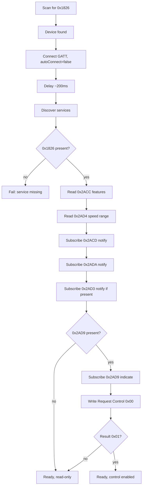

# FTMS Protocol Specification: MY-HI Q8Y

> **Status: PARTIALLY VERIFIED**, updated 2026-07-28 from the first nRF Connect
> capture. Static reads are done; the data stream and control point are not.
> Sections marked `TBD` must be resolved by running
> `05a-FTMS-Probe-Procedure.md` against the real device.
> **Do not invent values for `TBD` fields.**

---

## What this device actually is

The device advertises as **`FS-9F4235`**. `FS-` is FitShow (Xiamen) Information
Technology, who manufacture transparent-UART BLE modules for treadmills, exercise
bikes and rowers. This is confirmed by the presence of `FFE0` and `FFF0`, both
common transparent-serial service UUIDs, alongside the FTMS service.

```
treadmill motor board ←UART→ FitShow BLE module ←BLE→ phone
                                   │
                                   ├── FFE0 / FFF0   transparent serial
                                   │                  (what the FitShow app uses)
                                   ├── 180D          standard Heart Rate Service
                                   └── 1826          FTMS shim
```

**FTMS here is a vendor shim, not a native implementation.** That has one practical
consequence running through this entire document: **verify against hex, trust nothing
the device declares about itself.** Section 2 documents a concrete case where the
device's own feature declaration is provably false.

The FitShow UART protocol on `FFE0`/`FFF0` is undocumented and prior public attempts
to decode it have not succeeded. It is **not** a fallback plan. It is recorded here
for completeness only.

---

## 0. Reading this document

FTMS is a **GATT profile**, not an HTTP API. There are no endpoints, no JSON on the
wire, and no request bodies. Every interaction is one of:

| GATT operation | What it is |
|----------------|------------|
| Read | Client reads a characteristic's current value (raw bytes) |
| Write | Client writes raw bytes to a characteristic |
| Notify | Server pushes raw bytes to the client, unacknowledged |
| Indicate | Server pushes raw bytes to the client, acknowledged |

All multi-byte integers are **little-endian**.

Source of the protocol facts below: Bluetooth SIG *Fitness Machine Service*
specification v1.0 and the GATT Specification Supplement. Where this document states
a fact with a confidence qualifier, that qualifier is meaningful. Treat anything
below "high" as needing confirmation from the probe capture.

---

## 1. Service and characteristics

### Services discovered: VERIFIED

| UUID | Name | Used by this app |
|------|------|------------------|
| `1800` | Generic Access | No |
| `180A` | Device Information | Optional — firmware version for `DEVICE.md` |
| `180D` | **Heart Rate** | **Yes — preferred HR source, see §4a** |
| `FFE0` | Vendor (FitShow transparent serial) | No — recorded only |
| `FFF0` | Vendor (FitShow transparent serial) | No — recorded only |
| `1826` | **Fitness Machine** | **Yes — primary** |

### FTMS characteristics: VERIFIED PRESENT

| UUID | Name | Properties | Required by this app |
|------|------|------------|----------------------|
| `0x2ACC` | Fitness Machine Feature | Read | Advisory only — see §2 |
| `0x2ACD` | Treadmill Data | Notify | Yes — the core data stream |
| `0x2AD4` | Supported Speed Range | Read | Yes — drives all UI limits |
| `0x2AD9` | Fitness Machine Control Point | Write + Indicate | Speed control (unverified) |
| `0x2ADA` | Fitness Machine Status | Notify | Yes — machine-initiated events |
| `0x2AD3` | Training Status | Read + Notify | Optional — display only |

All six are present. That is better than expected for a shim implementation, but
**presence is not function.** `0x2AD9` exposing Write and Indicate says nothing about
whether it honours commands. See §7.

The app must still degrade gracefully: if the control point handshake fails, hide all
speed controls. Never fall back to guessed limits if `0x2AD4` is unreadable.

---

## 2. Fitness Machine Feature (`0x2ACC`): Read

**8 bytes: two little-endian uint32 bitfields.**

```
[0..3]  Fitness Machine Features   (uint32 LE)
[4..7]  Target Setting Features    (uint32 LE)
```

### Fitness Machine Features (bytes 0–3)

| Bit | Meaning |
|-----|---------|
| 0 | Average Speed supported |
| 1 | Cadence supported |
| 2 | Total Distance supported |
| 3 | Inclination supported |
| 4 | Elevation Gain supported |
| 5 | Pace supported |
| 6 | Step Count supported |
| 7 | Resistance Level supported |
| 8 | Stride Count supported |
| 9 | Expended Energy supported |
| 10 | Heart Rate Measurement supported |
| 11 | Metabolic Equivalent supported |
| 12 | Elapsed Time supported |
| 13 | Remaining Time supported |
| 14 | Power Measurement supported |
| 15 | Force on Belt and Power Output supported |
| 16 | User Data Retention supported |
| 17–31 | Reserved |

### Target Setting Features (bytes 4–7)

| Bit | Meaning |
|-----|---------|
| 0 | **Speed Target Setting supported** ← the one that decides Phase 6 |
| 1 | Inclination Target Setting supported |
| 2 | Resistance Target Setting supported |
| 3 | Power Target Setting supported |
| 4 | Heart Rate Target Setting supported |
| 5 | Targeted Expended Energy configuration supported |
| 6 | Targeted Step Number configuration supported |
| 7 | Targeted Stride Number configuration supported |
| 8 | Targeted Distance configuration supported |
| 9 | Targeted Training Time configuration supported |
| 10–31 | Remaining bits are further targeted-value configurations and reserved |

*Confidence: high on bits 0–13 of machine features and bits 0–4 of target settings;
moderate on the higher bits, which this device almost certainly does not set anyway.*

### ⚠️ THIS DEVICE'S FEATURE FLAGS ARE UNRELIABLE. DO NOT GATE ON THEM

Decoded from the first capture:

**Machine features claimed:** Total Distance, Step Count, Resistance Level, Expended
Energy, Heart Rate Measurement, Elapsed Time, Power Measurement

**Target features claimed:** Speed Target Setting, Inclination Target Setting,
Resistance Target Setting, Power Target Setting

Three of these are impossible:

| Claim | Reality |
|-------|---------|
| Resistance Level supported | Treadmills have no resistance mechanism |
| Power Measurement supported | This treadmill has no power meter |
| **Inclination Target Setting supported** | **The machine has no incline at all** |

The last one is decisive: inclination is **absent** from the machine-features word but
**present** in the target-settings word. A device cannot support setting a target for a
capability it does not report having. This is internally contradictory, which means the
bitmask is a stock value baked into FitShow module firmware rather than a description
of this treadmill.

Note also that the four claimed target bits are 0, 1, 2, 3 = `0x0000000F`, a
suspiciously round "all of them" value.

**Required handling (implemented in Phases 3, 4 and 6):**

- **Log `0x2ACC`, never branch on it.**
- **Dashboard fields** derive from the union of `0x2ACD` flag bits observed over the
  first ~30 seconds of a connection. A field is real if it arrives in packets.
- **Speed control** derives from the live control point handshake (§7), not from the
  Speed Target Setting bit, which is set, but carries little weight given the above.

*Confidence: high that the bitmask over-claims. The incline contradiction is direct
evidence. The raw hex is still needed to confirm the exact decode.*

### `TBD`: raw bytes still needed

```
Raw hex: ________________________________
```

Needed for parser unit test fixtures and to verify the decode above independently.
Two minutes in nRF Connect.

### Note on heart rate

The HR feature bit means the machine can *report* HR, not that a sensor is producing
usable data. This treadmill has handgrip sensors, which only work while gripped and
are noisy when they do. See §4a for the preferred source and the decision rule.

---

## 3. Supported Speed Range (`0x2AD4`): Read

**6 bytes, three uint16 LE values, all in units of 0.01 km/h.**

```
[0..1]  Minimum Speed      (uint16 LE, 0.01 km/h)
[2..3]  Maximum Speed      (uint16 LE, 0.01 km/h)
[4..5]  Minimum Increment  (uint16 LE, 0.01 km/h)
```

Example: `64 00 58 02 0A 00` → min 1.00 km/h, max 6.00 km/h, increment 0.10 km/h.

### VERIFIED

```
Minimum:   1.0 km/h
Maximum:  16.0 km/h
Increment: 0.1 km/h
```

The original spec draft's values were **correct**. An earlier revision of this document
questioned the 16 km/h figure as a running-treadmill number; that scepticism was
misplaced. This is a full folding treadmill, not a walking pad.

Still read this characteristic at runtime rather than hardcoding the values. The
methodology holds even where the guess happened to be right: `0x2AD4` is the only
authoritative source, and it costs one read.

Preset buttons should be generated from this range. Suggested set for 1.0–16.0:
2, 4, 6, 8, 10, 12 km/h, generated rather than hardcoded so the code survives a
firmware change or a different treadmill.

### `TBD`: raw bytes still needed

```
Raw hex: ____________
```

Expected to decode as `64 00 40 06 0A 00` (1.00 / 16.00 / 0.10 km/h in 0.01 units).
**Capture the actual bytes and confirm.** If they differ from this prediction, the
decode above is wrong and everything downstream inherits the error.

---

## 4. Treadmill Data (`0x2ACD`): Notify

The primary data stream. **This is the single most error-prone parse in the project.**

### Structure

```
[0..1]  Flags (uint16 LE)
[2..]   Fields, in the fixed order below, present only if their flag bit is set
```

### The three traps

**Trap 1: bit 0 is inverted.** The FTMS spec defines bit 0 as *More Data*.
Instantaneous Speed is present when bit 0 is **`0`**, absent when it is `1`. This is
the opposite of every other bit in the field. Decoding it as a normal presence bit
shifts every subsequent field and corrupts the entire packet. This trips up most
first-time FTMS implementations.

**Trap 2: Total Distance is uint24.** Three bytes, little-endian. There is no
`BitConverter` overload; assemble it manually:

```csharp
uint distance = (uint)(data[i] | (data[i + 1] << 8) | (data[i + 2] << 16));
i += 3;
```

**Trap 3: Expended Energy is one flag bit but three fields**, 5 bytes total:
Total Energy (uint16, kcal), Energy Per Hour (uint16, kcal), Energy Per Minute
(uint8, kcal). Advancing 2 bytes instead of 5 misaligns everything after it.

### Field table

Fields appear in this order. Skip any whose flag bit is clear.

| Flag bit | Field | Type | Bytes | Resolution | Unit |
|----------|-------|------|-------|------------|------|
| 0 == 0 | Instantaneous Speed | uint16 | 2 | 0.01 | km/h |
| 1 | Average Speed | uint16 | 2 | 0.01 | km/h |
| 2 | Total Distance | **uint24** | **3** | 1 | m |
| 3 | Inclination | sint16 | 2 | 0.1 | % |
| 3 | Ramp Angle Setting | sint16 | 2 | 0.1 | degree |
| 4 | Positive Elevation Gain | uint16 | 2 | 0.1 | m |
| 4 | Negative Elevation Gain | uint16 | 2 | 0.1 | m |
| 5 | Instantaneous Pace | uint8 | 1 | 0.1 | km/min |
| 6 | Average Pace | uint8 | 1 | 0.1 | km/min |
| 7 | Total Energy | uint16 | 2 | 1 | kcal |
| 7 | Energy Per Hour | uint16 | 2 | 1 | kcal |
| 7 | Energy Per Minute | uint8 | 1 | 1 | kcal |
| 8 | Heart Rate | uint8 | 1 | 1 | bpm |
| 9 | Metabolic Equivalent | uint8 | 1 | 0.1 | — |
| 10 | Elapsed Time | uint16 | 2 | 1 | s |
| 11 | Remaining Time | uint16 | 2 | 1 | s |
| 12–15 | Reserved | | | | |

Bits 3 and 4 each gate **two** fields (4 bytes each). Bit 7 gates three (5 bytes).

*Confidence: high on bits 0, 1, 2, 7, 8, 10, these are the ones this device will
actually use. Moderate on the pace resolution (bits 5–6) and metabolic equivalent;
verify from the capture if the device sets them.*

### Notification rate

The FTMS specification states the server should notify **approximately once per
second**, and the interval is not configurable by the client.

**The original draft's "5–10 updates/sec" is almost certainly wrong.** Measure it.

If the measured rate really is above 1 Hz, throttle UI binding updates to 4 Hz or
MAUI will jank in split screen. The 5-second telemetry sampling cadence in
`14-Database.md` is unaffected either way.

### Range limits (no rollover risk in practice)

| Field | Max value | Real-world limit |
|-------|-----------|------------------|
| Elapsed Time (uint16) | 65,535 s | 18.2 hours |
| Total Distance (uint24) | 16,777,215 m | 16,777 km |
| Total Energy (uint16) | 65,535 kcal | not reachable in a session |

None of these will roll over in a single workout. **They may roll over or reset
across sessions.** See the counter semantics question below.

### Parser requirements

- **Cursor-based and flag-driven. Never fixed-offset.**
- **Validate length before parsing:** compute the expected byte count from the flags
  and reject the packet if it doesn't match. Log rejected packets with their hex. Do
  not read past the buffer.
- Return a struct, not a heap allocation, on the hot path.
- Treat every field as optional in the domain model (`double?`, `int?`), because
  presence is per-packet, not per-device.

### `TBD`: counter semantics

**This determines the entire Phase 7 recording implementation.**

```
Do Total Distance / Total Energy / Elapsed Time reset when a session ends,
or accumulate since power-on?

[ ] Per-session (reset to 0 when the belt stops / a new session starts)
[ ] Cumulative since power-on
[ ] Something else: ________________________________
```

- **Per-session:** record reported values directly.
- **Cumulative:** every workout value is a delta against the value captured at
  workout start, and the engine must detect a mid-workout reset (value decreases) and
  re-baseline.

### `TBD`: measured sample packets

```
Flags observed (hex):       ____________
Fields present:             ____________________________
Notification rate:          _____ Hz
Sample packet at rest:      ____________________________
Sample packet at 3 km/h:    ____________________________
Sample packet at max speed: ____________________________
```

---

## 4a. Heart Rate Service (`180D`): the preferred HR source

The device exposes a **standard Heart Rate Service** in addition to the FTMS heart rate
field. Two sources for the same value.

### Characteristic `0x2A37`: Heart Rate Measurement, Notify

```
[0]     Flags (uint8)
          bit 0:    0 = HR value is uint8, 1 = HR value is uint16
          bits 1-2: sensor contact status
          bit 3:    Energy Expended present
          bit 4:    RR-Interval present
[1..]   Heart Rate Measurement (uint8 or uint16 per bit 0)
[..]    Energy Expended (uint16, kJ) if flagged
[..]    RR-Intervals (uint16 each, 1/1024 s) if flagged
```

For a treadmill handgrip sensor, expect flags `0x00` and a single uint8, the simplest
possible case.

**Sensor contact status (bits 1–2)** is directly useful here: it distinguishes "user is
not gripping" from "reading is zero", which is exactly the ambiguity handgrip sensors
create.

| Value | Meaning |
|-------|---------|
| `0b00` / `0b01` | Contact detection not supported |
| `0b10` | Contact detection supported, **contact not detected** |
| `0b11` | Contact detection supported, contact detected |

*Confidence: high. This is a long-stable, widely-implemented standard service.*

### Why prefer this over the FTMS field

A dedicated single-purpose characteristic is far less likely to be mangled by a vendor
shim than a conditionally-present field buried inside a flag-driven FTMS record. If the
shim gets any part of the `0x2ACD` layout wrong, HR is one of the later fields and
therefore among the first to be corrupted.

**Rule:** use `0x2A37` if it produces usable data. Fall back to the FTMS field only if
`180D` is dead.

### Decision rule for whether HR ships at all

Handgrip sensors only read while gripped, and are noisy when they do. **If the capture
shows sparse, implausible, or wildly unstable values, cut heart rate from the dashboard
and charts entirely.** A metric that is wrong half the time is worse than no metric:
it will pollute the average and maximum HR columns in every stored workout.

Recording the field in `WorkoutSample` while hiding it from the UI is a reasonable
middle position if you want to revisit later.

### `TBD`: measurement needed

```
Does 0x2A37 notify?                        [ ] yes  [ ] no
Flags value:                                0x____
Contact detection supported?                [ ] yes  [ ] no
Plausible values while gripping?            [ ] yes  [ ] no
Value while gripping: ______ bpm   Actual pulse (manual count): ______ bpm
Does the FTMS 0x2ACD HR field agree?        [ ] yes  [ ] no  [ ] field absent
Time from grip to first reading:            ______ s
Behaviour on release:                       [ ] goes to 0  [ ] holds last  [ ] stops
```

---

## 5. Fitness Machine Status (`0x2ADA`): Notify

**This is an event stream, not a state string.** The original draft described it as
returning `{"status": "Running"}`. That is not what this characteristic does. It
reports *what just happened*, typically as a result of user action on the machine
itself. The app maintains its own state; this feeds transitions into it.

### Structure

```
[0]     Op Code (uint8)
[1..]   Parameters (op-code dependent, often absent)
```

### Op codes

| Op | Meaning | Parameters |
|----|---------|------------|
| `0x01` | Reset | — |
| `0x02` | Stopped or Paused by the user | uint8: `0x01` stop, `0x02` pause |
| `0x03` | Stopped by safety key | — |
| `0x04` | Started or resumed by the user | — |
| `0x05` | Target speed changed | uint16, 0.01 km/h |
| `0x06` | Target incline changed | sint16, 0.1 % |
| `0x07` | Target resistance level changed | — |
| `0x08` | Target power changed | — |
| `0x09` | Target heart rate changed | — |
| `0xFF` | Control permission lost | — |

*Confidence: high on `0x01`–`0x05` and `0xFF`; moderate on `0x06`–`0x09`, which are
not relevant to a treadmill without incline. Additional op codes exist for targeted
energy/step/distance/time changes and for training-time elapsed events; capture will
show which this device actually emits.*

**`0xFF` (control permission lost) matters:** on receiving it, the app must disable
speed controls and re-issue `Request Control` before re-enabling them.

**`0x03` (safety key) matters:** treat as an immediate hard stop. Do not attempt to
restart the machine over BLE in response.

### `TBD`: which events does this device actually emit?

```
Observed op codes: ____________________________________
Does it emit 0x04 when you press Start on the console?   [ ] yes  [ ] no
Does it emit 0x02 when you press Stop on the console?    [ ] yes  [ ] no
Does it emit 0x05 when you change speed on the console?  [ ] yes  [ ] no
```

If the device emits nothing here, the app must infer machine state from `0x2ACD`
speed values instead, workable, but less precise. Note that in `ASSUMPTIONS.md`.

---

## 6. Training Status (`0x2AD3`): Read + Notify

Distinct from both Machine Status and the app's workout state. Display-only.

```
[0]     Flags (uint8)
          bit 0: Training Status String present
          bit 1: Extended String present
[1]     Training Status (uint8)
[2..]   Training Status String (UTF-8), if flagged
```

| Value | Meaning |
|-------|---------|
| `0x00` | Other |
| `0x01` | Idle |
| `0x02` | Warming Up |
| `0x03` | Low Intensity Interval |
| `0x04` | High Intensity Interval |
| `0x05` | Recovery Interval |
| `0x06` | Isometric |
| `0x07` | Heart Rate Control |
| `0x08` | Fitness Test |
| `0x09` | Speed Outside of Control Region — Low |
| `0x0A` | Speed Outside of Control Region — High |
| `0x0B` | Cool Down |
| `0x0C` | Watt Control |
| `0x0D` | Manual Mode |
| `0x0E` | Pre-Workout |
| `0x0F` | Post-Workout |

**Observed on this device at rest: `Idle` (`0x01`).** That at least means the
characteristic is populated rather than stubbed, which is mildly encouraging for the
shim's overall quality. Whether it transitions meaningfully during a session is
unverified.

*Confidence: high on the enum; low on whether this device implements it usefully.
Many budget machines report a single value permanently.*

**Do not drive the app's workout state machine from this characteristic.**

---

## 7. Fitness Machine Control Point (`0x2AD9`): Write + Indicate

The only writable characteristic. Governs speed control, start, and stop.

### Mandatory sequence: omitting any step is the usual cause of silent failure

1. **Enable indications** on `0x2AD9` by writing `0x0002` to its CCCD descriptor
   (`0x2902`). Some machines reject writes if indications aren't enabled.
2. **Write `Request Control` (`0x00`)** and wait for a successful indication.
3. Only then send any other command.
4. **Re-issue `Request Control` after every reconnect** and after any `0xFF`
   (control permission lost) status event.

### Write requirements

- Use **Write With Response**, not write-without-response.
- **Serialise commands.** One outstanding command at a time. Wait for the indication
  (3-second timeout) before sending the next. Concurrent writes get dropped or error.
- Debounce user input upstream so rapid +/- taps produce one write of the final
  target, not one per tap.

### Commands

| Command | Bytes | Notes |
|---------|-------|-------|
| Request Control | `00` | Must succeed first |
| Reset | `01` | |
| Set Target Speed | `02 LL HH` | uint16 LE, 0.01 km/h |
| Set Target Inclination | `03 LL HH` | sint16, 0.1 % — not applicable if no incline |
| Start or Resume | `07` | |
| Stop or Pause | `08 01` (stop) / `08 02` (pause) | **The parameter byte is mandatory** — `08` alone is malformed |

Set Target Speed example: 6.5 km/h → 650 → `0x028A` → bytes `02 8A 02`.

*Confidence: high. Opcodes `0x00`, `0x01`, `0x02`, `0x07`, `0x08` and the `0x80`
response format are well-established across FTMS implementations.*

Other opcodes exist (`0x04` resistance, `0x05` power, `0x06` target heart rate,
`0x09`–`0x0D` targeted energy/steps/strides/distance/time). None apply to this app.

### Response format (arrives as an indication)

```
[0]     0x80  (Response Code — always)
[1]     Request Op Code (the command being answered)
[2]     Result Code
[3..]   Response parameters (rare)
```

| Result | Meaning | App behaviour |
|--------|---------|---------------|
| `0x01` | Success | Proceed |
| `0x02` | Op Code not supported | Disable that control permanently, log it |
| `0x03` | Invalid Parameter | Bug in clamping — log with the sent value |
| `0x04` | Operation Failed | Retry once, then surface to user |
| `0x05` | Control Not Permitted | Re-issue Request Control, then retry once |

These result codes are **machine-level and unrelated to the app-level error codes in
section 9.** Do not merge the two numbering schemes.

### `TBD`: control point behaviour

```
Does the device expose 0x2AD9?                        [ ] yes  [ ] no
Does Request Control (0x00) return 0x01?              [ ] yes  [ ] no
Does Set Target Speed work while the belt is stopped? [ ] yes  [ ] no
Does Set Target Speed work while the belt is running? [ ] yes  [ ] no
Does Start (0x07) start the belt from stopped?        [ ] yes  [ ] no
Does Stop (0x08 01) stop the belt?                    [ ] yes  [ ] no
Does control permission expire after inactivity?      [ ] yes  [ ] no  after ___ s
Observed response bytes for each command:             ______________________
```

**Safety:** if `Start` works remotely, the app must not start the belt without an
explicit, deliberate user action on screen. Never start it from a notification action,
a restored state, or an auto-reconnect.

---

## 8. Connection sequence



**Order matters.** Read the feature and range characteristics *before* subscribing,
so the UI is configured correctly by the time data starts arriving. Subscribe to the
control point *before* writing to it.

### MTU

Default ATT MTU is 23 bytes, giving 20 bytes of payload. A fully-populated Treadmill
Data record can exceed that, in which case the machine splits it across notifications
using the More Data bit. Requesting a larger MTU (`requestMtu(517)`) after connecting
usually avoids this and is worth doing, but the parser **must still handle the split
case correctly** rather than assuming it won't happen.

**`TBD`: negotiated MTU: ______ · Does the device ever split records? [ ] yes [ ] no**

---

## 9. Application error codes

App-level only. Distinct from FTMS control point result codes (section 7).

| Code | Meaning | User-facing action |
|------|---------|--------------------|
| 1001 | Bluetooth disabled | Prompt to enable |
| 1002 | Permission denied | Link to app settings |
| 1003 | Device not found | Retry scan |
| 1004 | Connection timeout | Retry |
| 1005 | GATT error (incl. 133) | Retry with backoff |
| 1006 | FTMS service missing | Device unsupported |
| 1007 | Required characteristic missing | Device unsupported |
| 1008 | Notification subscribe failed | Reconnect |
| 1009 | Control point write failed | Retry once |
| 1010 | Control not granted | Re-request control |
| 1011 | Control response timeout | Retry once |
| 1012 | Malformed packet | Log and drop; not user-facing |

Codes 1002, 1005, 1008, 1011, and 1012 were absent from the original draft and are
all reachable in practice.

---

## 10. Open questions summary

### Resolved 2026-07-28

| Question | Answer |
|----------|--------|
| Which characteristics are exposed? | All six FTMS, plus `180D`, `FFE0`, `FFF0` |
| Supported speed range and increment | 1.0–16.0 km/h, 0.1 increment |
| Does the device require bonding? | No |
| Is heart rate available? | `180D` present; usability unverified |
| Signal strength at walking position | ≈ −49 dBm (strong) |

### Outstanding: priority order

| # | Question | Blocks | Needs the belt? |
|---|----------|--------|-----------------|
| 1 | **Are counters per-session or cumulative?** | Phase 7 entirely | Yes |
| 2 | **Does the control point honour commands?** | Whether Phase 6 exists | Yes |
| 3 | Raw hex for `0x2ACC` and `0x2AD4` | Parser test fixtures | No |
| 4 | Treadmill Data flags, packet layout, matched console values | Phase 4 correctness | Yes |
| 5 | Is `0x1826` in the advertisement? | Phase 1 scan filter | No |
| 6 | MAC address and address type | Device persistence, schema | No |
| 7 | Notification rate | Phase 4 throttling | No |
| 8 | `0x2A37` vs FTMS HR, and whether HR is usable at all | Phase 4 | Yes |
| 9 | Does the device emit Machine Status events? | Phase 5 | Yes |
| 10 | Does control permission expire? | Phase 6 | Yes |
| 11 | Negotiated MTU; does the device split records? | Parser | No |

Items 3, 5, 6, 7 and 11 need no walking and take about ten minutes together in nRF
Connect. Do those first.

**Do not write Phase 4 code until items 1, 2 and 4 are answered.** Items 1 and 2 in
particular determine whether two whole phases exist in their planned form.
