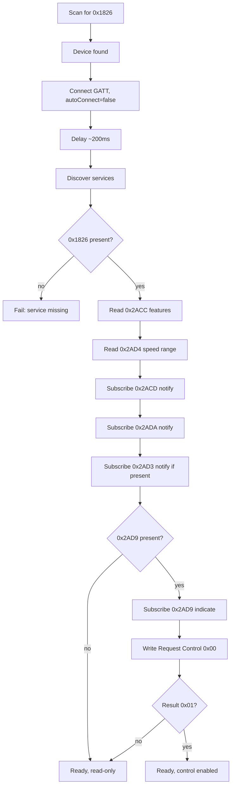

# Phase 00 — Probe App

> **This phase exists to make the treadmill answer questions, not to build a product.**
> Every screen here is a lab instrument. None of it ships in the final UI, and none of
> it needs to be pretty. It needs to be *correct about bytes*.

**Hardware:** required, at the end · **Size:** L · **Blocks:** everything

---

## Goal

Produce an installable Android app that, on the operator's phone, can:

1. Find the treadmill and connect to it.
2. Show every service and characteristic, and dump every readable one as raw hex.
3. Subscribe to every notifying characteristic and log each packet as
   `timestamp | uuid | hex`.
4. **Send arbitrary bytes to the control point `0x2AD9` and show the raw response**,
   both via preset command buttons and via a free-text hex field.
5. **Record what happened**: export the session as a file, and let the operator mark
   an observation as confirmed-correct with a note.

After this phase, the question "what data should we send to the treadmill?" is
answered by experiment rather than by reading a spec and hoping the vendor followed it.

## Why it is shaped this way

The device is a **FitShow BLE module** presenting an FTMS shim over a transparent
UART bridge (`PHASE-00-FINDINGS.md`). Its own feature declaration `0x2ACC` is **provably
false**: it claims incline target setting on a machine with no incline. A shim that
lies about itself is not a thing to build three phases of product on top of.

So the first deliverable is the instrument, and the instrument's output becomes the
specification.

---

## Reference docs

Read these. Do not read other phase folders.

- The protocol reference below: characteristics, control point commands and
  response format, connection sequence. **The control point section is the one
  this phase is built around.** (Parsing the data-stream characteristics — the
  actual byte decode — is out of scope here; that's Phase 01, deliberately, per
  the Scope section below.)
- `HUMAN-RUNBOOK.md`: the manual procedure this phase's Probe Checklist screen (0.9)
  automates.
- `PHASE-00-FINDINGS.md`: what is already measured. Everything marked NEEDED is your target.
- `../../README.md`: stack table, permissions.

---

## Protocol reference: characteristics and control point

> This is the minimal slice of the FTMS protocol this phase needs standalone, so
> this folder stays self-contained per `../README.md`'s own rule. The full
> byte-level parsing reference (feature flags, treadmill data fields and their
> traps, heart rate, machine status, training status) lives in
> `../phase-01-protocol-decode/README.md`, since that's the phase that actually
> decodes them — this phase only dumps hex and sends control commands, it doesn't
> decode the data stream.

### FTMS characteristics

| UUID | Name | Properties |
|------|------|------------|
| `0x2ACC` | Fitness Machine Feature | Read |
| `0x2ACD` | Treadmill Data | Notify |
| `0x2AD3` | Training Status | Read, Notify |
| `0x2AD4` | Supported Speed Range | Read |
| `0x2AD9` | Fitness Machine Control Point | Write, Indicate |
| `0x2ADA` | Machine Status | Notify |

Plus `1800` Generic Access, `180A` Device Information, `180D` Heart Rate, and the
vendor `FFE0`/`FFF0` transparent-serial services (FitShow, recorded only — see
`PHASE-00-FINDINGS.md`).

### Control point (`0x2AD9`) commands

The only writable characteristic. **Mandatory sequence** — omitting any step is
the usual cause of silent failure:

1. **Enable indications** on `0x2AD9` (write `0x0002` to CCCD `0x2902`).
2. **Write `Request Control` (`00`)** and wait for a successful indication.
3. Only then send any other command. Use **Write With Response**.
4. **Serialise commands**: one outstanding, wait for the indication (3 s timeout)
   before the next.

| Command | Bytes | Notes |
|---------|-------|-------|
| Request Control | `00` | Must succeed first |
| Reset | `01` | |
| Set Target Speed | `02 LL HH` | uint16 LE, 0.01 km/h |
| Set Target Inclination | `03 LL HH` | sint16, 0.1 % — not applicable, no incline |
| Start or Resume | `07` | |
| Stop or Pause | `08 01` (stop) / `08 02` (pause) | **Parameter byte is mandatory** |

Set Target Speed example: 6.5 km/h → 650 → `0x028A` → bytes `02 8A 02`.

**Response** arrives as an indication: `[0] 0x80 (always) [1] echoed op code [2]
result code [3..] rare parameters`.

| Result | Meaning |
|--------|---------|
| `0x01` | Success |
| `0x02` | Op Code not supported |
| `0x03` | Invalid Parameter |
| `0x04` | Operation Failed |
| `0x05` | Control Not Permitted |

The full control-point reference — including app-facing result handling and
retry rules — lives in `../phase-05-treadmill-control/README.md`, since that's
the phase that turns this into product UI.

### Connection sequence

Read the feature and range characteristics *before* subscribing. Subscribe to the
control point *before* writing to it. Default ATT MTU is 23 bytes (20 bytes
payload); request a larger MTU (`requestMtu(517)`) after connecting.

---

## Technology decisions

> This project has one developer, indefinitely. Every dependency here is
> justified on that basis, not on theoretical best-practice: maintainability over
> purity, no abstraction or pattern without a concrete payoff, and every library
> weighed against "is what it saves worth what it costs to understand and keep
> working." Verified against package status as of August 2026.

### .NET MAUI (Android-only)

**What problem does it solve?** The app needs a native Android UI, background BLE
handling that survives screen lock, and local SQLite storage, all written by
someone who already knows C#/.NET rather than starting a second language from
zero.

**Why are we using it?** It's the only option in the comparison below that
doesn't require learning a new language *and* a new UI toolkit *and* a new BLE
story simultaneously. This phase proves it end to end: BLE scan/connect/GATT,
background-safe patterns, SQLite, a working installable APK.

**Alternatives considered:**

1. **Native Android (Kotlin + Jetpack Compose)** — zero abstraction between you
   and the platform, the largest body of BLE-on-Android tutorials to draw from,
   but an entirely new language and UI framework to learn at the same time as
   BLE/FTMS, which is already the hard part of this project. Worth it only if
   Android-specific APIs turn out to be needed constantly; this project's
   Android-specific needs (foreground service types, HyperOS battery quirks) are
   real but narrow, not pervasive.
2. **Flutter (Dart)** — strong BLE plugin ecosystem, good performance, but a new
   language *and* new BLE APIs *and* no code-reuse from existing C# knowledge.
   Worth it only if the target were cross-platform (iOS too); that's an explicit
   non-goal here.
3. **React Native** — JavaScript/TypeScript, huge ecosystem, but BLE support is
   entirely third-party and historically inconsistent across Android versions.
   Same "new language for no reason" problem as Flutter for a C#-fluent,
   Android-only developer.

**Why not the alternatives?** All three cost a new language for a
single-developer, Android-only, already-C# project with zero payoff.
Cross-platform reach (Flutter/RN's main selling point) is explicitly a non-goal
(see the root README's non-goals list, which rules out iOS). Native Kotlin is the
only one with a real argument (maximum platform control), but this project's
Android-specific surface is narrow enough that MAUI's platform-specific escape
hatches (`Platforms/Android/`) already cover it without giving up C#.

**Long-term considerations.** Standard, Microsoft-maintained, tracks .NET's own
release cadence. Not easily "replaceable" in the sense of swapping a library — a
framework choice is closer to a foundation than a dependency. Performance is
adequate for this app's actual workload (a dashboard updating at ≤4 Hz, not a
game).

**Practical example:** `src/MyHi.Companion/`: the whole app, built and running as
of this phase.

### `Plugin.BLE` (`dotnet-bluetooth-le`)

**What problem does it solve?** Raw Android BLE (`BluetoothGatt` and its callback
interface) is verbose, callback-heavy, and the single biggest source of
undocumented device-specific quirks (GATT error 133, connect/discover timing) in
any BLE app. Something has to own that callback plumbing.

**Why are we using it?** It's the foundation of this phase's app:
`TreadmillConnection`, `BleScanner`, `ControlPointClient` are all built on
`Plugin.BLE`'s `IAdapter`/`IDevice`/`ICharacteristic`, with this specific
treadmill's GATT 133 mitigations (`autoConnect:false`, close-before-reconnect,
the 200ms discovery delay) validated against real hardware.

**Alternatives considered:**

1. **Direct Android bindings** (`Android.Bluetooth.*` in `Platforms/Android/`) —
   full control, no abstraction layer between you and the bug, but several
   hundred lines of callback plumbing to write and maintain yourself: threading,
   state machine, MTU negotiation, all from scratch. Worth it only if
   `Plugin.BLE`'s own abstraction ever actively blocks a fix a later phase needs —
   that's the specific escape hatch this decision names, not a general
   preference.
2. **Shiny.BluetoothLE** — actively maintained, modern reactive
   (`IObservable`-based) API, generally cleaner reconnect/observability story.
   But it's a second async paradigm (Rx observables) layered on top of the
   `async`/`await` used everywhere else in this codebase, and switching now means
   re-deriving the GATT 133 mitigations against a different API shape with no
   guarantee they translate cleanly. Worth it for a greenfield BLE project, or if
   `Plugin.BLE`'s maintenance visibly stalls in the future.
3. **Hand-rolled minimal wrapper** (just the handful of GATT operations this app
   actually needs) — zero dependency, smallest possible surface, but reinvents
   exactly the boilerplate `Plugin.BLE` already solved, with none of this phase's
   validation carried over.

**Why not the alternatives?** Direct bindings rejected because this phase is
done, working, and already paid the callback-plumbing cost via `Plugin.BLE`.
Repaying it now for a single-platform app buys nothing. Shiny rejected on
switching cost, not quality: its reactive model may well be better in the
abstract, but this project already has hardware-validated mitigations against
*this specific treadmill's* quirks sitting in `Plugin.BLE` code, and that
validation is the expensive part, not the library choice. A hand-rolled wrapper
rejected as strictly more code for equivalent behavior with nothing written yet.

**Long-term considerations.** Worth naming honestly: `Plugin.BLE` is swappable in
principle (MIT, broadly referenced in MAUI BLE tutorials) but *not* currently
isolated behind a clean seam. `TreadmillConnection.GattCharacteristicInfo.Native`
exposes raw `Plugin.BLE` `ICharacteristic` objects, and the diagnostic screens
deliberately reach through to them — a reasonable trade for a diagnostic tool
that needs raw access, but it means `TreadmillConnection` itself isn't the real
isolation boundary. **The actual seam is `ITreadmillService`** (Phase 01b
onward): nothing above that interface touches `Plugin.BLE` types at all, which is
where a future swap would actually happen if it ever needs to.

**Practical example:**
`src/MyHi.Companion/Features/Bluetooth/TreadmillConnection.cs`, extended with
reconnect/backoff in Phase 02.

### MAUI Shell (navigation)

**What problem does it solve?** The app needs to move between screens (scan →
dashboard → diagnostics → settings → history → backup) with back-stack behavior,
and construct each page with its ViewModel via DI rather than `new PageX()`
scattered across the codebase.

**Why are we using it?** It's not a third-party dependency — it ships as part of
the MAUI SDK itself, is Microsoft's own default-recommended navigation system,
already wired up here (`AppShell.xaml`, `Routing.RegisterRoute`), and this app's
navigation shape (a fairly flat set of screens, no deep multi-level flows) is
exactly Shell's sweet spot.

**Alternatives considered:**

1. **Plain `NavigationPage` + manual `PushAsync`/`PopAsync`** — simpler mental
   model for a small app, more directly traceable, but no built-in flyout/tabs
   without extra wiring, and loses Shell's URI-style navigation. Worth naming
   honestly: this app's current size is arguably close to where this becomes
   competitive.
2. **Hand-rolled navigation service** — complete control, easy to unit-test in
   isolation, but Shell already *is* this, maintained by the MAUI team,
   DI-integrated out of the box. Re-solves a problem the SDK ships a solution
   for.
3. **`TabbedPage`/`FlyoutPage` without Shell** — the older building blocks Shell
   was built to unify; more manual wiring for equivalent behavior. Only makes
   sense in a legacy Xamarin.Forms codebase.

**Why not the alternatives?** Plain `NavigationPage` is the only genuinely
competitive option. This phase already built `AppShell.xaml` with route
registration, and Shell's overhead over `NavigationPage` for an app this size is
small enough that reverting for marginal simplicity isn't worth undoing working
code.

**Long-term considerations.** About as safe as a choice gets — part of the MAUI
SDK, tracking .NET/MAUI's own release cadence exactly. No independent
community-support risk beyond "is MAUI itself still developed."

**Practical example:** `AppShell.xaml`; Phase 03 making the dashboard the new
Shell landing page; Phase 08/09's settings/backup routes.

---

## Scope

**In:** scaffolding, permissions, scan, connect, GATT tree, hex read dump,
notification log, control-point console, capture export, guided probe checklist,
SQLite factory + empty migration runner.

**Out:** parsers (Phase 01: this phase shows *hex*, it does not decode it),
auto-reconnect (Phase 02), dashboard, workouts, persistence of workout data.

> **The one decoding exception:** the control-point *response* is decoded, because an
> operator staring at `80 00 01` needs to be told that means "Request Control →
> Success" to make a decision in the next thirty seconds. That is three lines of
> lookup, not a parser. Everything else stays hex.

---

## Tasks

Work `TASKS.md` in order. Summary:

| # | Task | Output |
|---|------|--------|
| 0.1 | Project scaffold | Buildable MAUI Android app, DI, logging, Shell, dark theme |
| 0.2 | Permissions + adapter state | `BLUETOOTH_SCAN` / `BLUETOOTH_CONNECT`, enable prompt |
| 0.3 | Scan screen | Device list, RSSI, filter toggle |
| 0.4 | Connect + discovery | GATT tree screen, MTU request |
| 0.5 | Read dump screen | Every readable characteristic as hex, copy button |
| 0.6 | Notification log screen | Live `timestamp \| uuid \| hex`, per-characteristic toggles |
| 0.7 | **Control point console** | Preset buttons + free hex, decoded result code |
| 0.8 | Capture recorder | JSONL session file, share/copy, confirm-and-annotate |
| 0.9 | Guided probe checklist | Parts A–G as a form; exports pasteable markdown |
| 0.10 | Rolling file log | logcat + file, shareable |
| 0.11 | SQLite factory + migration runner | Empty migration set, DB file created on first run |

---

## Deliverables

1. **Installable APK** the operator can sideload.
2. **Six working screens**: Scan, GATT Tree, Read Dump, Notification Log, Control
   Console, Probe Checklist.
3. **`captures/` output**: at least one real session file committed to the repo after
   the `[HUMAN]` run.
4. **`PHASE-00-FINDINGS.md` updated**: every field the run answered, the verdicts
   that decide later phases, and the "Still unresolved after this run" table kept
   current — this is the project's single register of open questions.

---

## Automated tests

There is very little to unit-test here, and that is expected. This phase is I/O.
Test what is pure:

- Hex string ↔ byte array round-trip, including odd-length and whitespace input.
- Control-point command builder: `SetSpeed(6.5)` → `02 8A 02`. Table-drive it against
  the examples in this README's "Control point (`0x2AD9`) commands" reference above.
- Control-point response decoder: `80 00 01` → `(RequestControl, Success)`;
  `80 02 03` → `(SetTargetSpeed, InvalidParameter)`; short buffer → rejected, not
  crashed.
- Capture file writer produces valid JSONL and survives a mid-write kill.

## `[HUMAN]` tests

See `HUMAN-RUNBOOK.md`. The agent stops here and requests results.

---

## Acceptance

- [ ] Build is clean, zero warnings.
- [ ] App launches; DB file created on first run.
- [ ] Treadmill discovered on 5 of 5 scans.
- [ ] Connects and reaches a discovered-services state.
- [ ] Every readable characteristic dumps hex; the value is copyable.
- [ ] Notification log records `0x2ACD` packets with timestamps.
- [ ] Control console sends `00` (Request Control) and displays the raw response
      **and** its decoded meaning.
- [ ] A session capture file exists in `../../captures/` and is committed.
- [ ] `PHASE-00-FINDINGS.md` answers, unambiguously:
      - **Counter semantics** — per-session or cumulative? (blocks Phase 06 entirely)
      - **Control point verdict** — does it honour commands? (decides whether Phase 05 exists)
      - **Heart rate verdict** — usable / marginal / cut
      - Raw hex for `0x2ACC` and `0x2AD4`
      - Notification rate, negotiated MTU, MAC + address type, is `0x1826` advertised
- [ ] `PHASE-00-FINDINGS.md` has no remaining NEEDED field that this run could have answered.

---

## What "record what is correct" means concretely

Three levels, all delivered by task 0.8:

| Level | Mechanism |
|-------|-----------|
| Raw | Every byte in and out, timestamped, to a JSONL file. No interpretation. |
| Annotated | Operator taps an entry → "Confirm" + free-text note ("belt actually started here"). Stored alongside the raw entry. |
| Concluded | Probe Checklist screen (0.9) → verdicts → exported markdown → pasted into `PHASE-00-FINDINGS.md` and `PHASE-00-FINDINGS.md`. |

The raw layer is the one that matters most. Notes and verdicts can be re-derived from
raw bytes; raw bytes cannot be re-derived from a note that says "worked".

---

## Traps that will otherwise be hit

- **Subscribe to indications on `0x2AD9` before writing to it.** Write the CCCD
  `0x2902` value `0x0002`. Some machines silently drop writes otherwise. This is the
  single most common cause of "the control point does nothing".
- **`Request Control` (`00`) must be written and acknowledged before any other
  command**, and re-issued after every reconnect.
- **Serialise control point writes.** One outstanding command; wait for the
  indication (3 s timeout) before sending the next.
- **Use Write With Response**, not write-without-response.
- **`Stop or Pause` needs its parameter byte.** `08 01` stop, `08 02` pause. Bare
  `08` is malformed.
- **GATT 133** will happen. Always `close()` the `BluetoothGatt` before reconnecting,
  connect with `autoConnect: false`, and put ~200 ms between connect and
  `discoverServices()`.
- **Scan throttling**: Android allows ~5 scan starts per 30 s window, then silently
  returns nothing with no error. Debounce the scan button; never auto-restart in a loop.
- **Do not decode `0x2ACD` in this phase.** Showing a decoded speed the operator
  half-believes is worse than showing hex they must read. Decoding is Phase 01, after
  fixtures exist.

---

## Safety

The control console can start the belt. Put a **confirmation dialog on any command
that can cause motion** (`07` Start, and `02` Set Target Speed when the belt is
stopped), and a permanent banner on the console screen:

> The physical safety key is the emergency stop. This app is not.

---

## Definition of done

The operator can hand back a file that says what this treadmill actually does, and
Phase 01 can be written against bytes instead of against hope.
