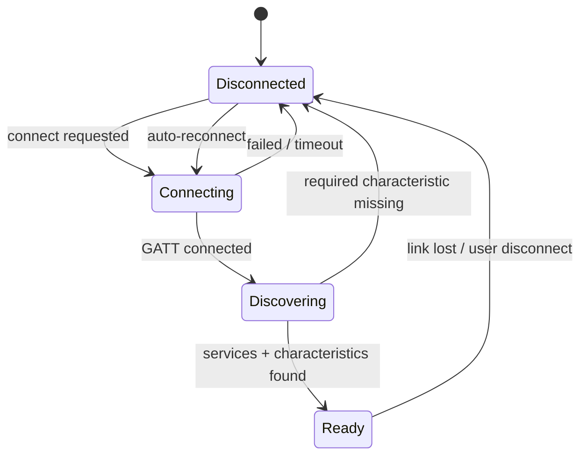

# Phase 02 — Connection Hardening

> Phase 00 connects once, by hand. This phase makes it stay connected, and come back
> on its own when it doesn't.

**Hardware:** required · **Size:** M · **Blocked by:** Phase 01

---

## Goal

A GATT connection that survives the real world: range loss, Bluetooth toggles,
treadmill power cycles, app restarts.

## Reference docs

- `../../05-FTMS-Protocol.md` §8 connection sequence
- `../../00-Project-Plan.md` — GATT 133 mitigations
- `../phase-00-probe-app/PHASE-00-FINDINGS.md` — Part E resilience results, MAC and
  address type

---

## Features

- Connect / disconnect
- **Remember last device** in `Preferences` — by MAC, **unless** Phase 00 found a
  random resolvable address, in which case match by name and fix
  `UX_Device_MacAddress` in `../../14-Database.md`
- Auto-reconnect with exponential backoff: 1 s, 2 s, 4 s, 8 s, 16 s, then 30 s steady.
  **Cancellable and capped** — do not retry forever with the screen off
- Connection state surfaced to the UI
- Production scan filter fixed to whichever of `0x1826` / `FS-` prefix Phase 00 proved
  works. **Ship one, not both**, and document why in `../../DEVICE.md`

## Connection state machine

**This machine is independent of the workout state machine** (Phase 04). Both run
concurrently. A single combined diagram cannot express "connection lost mid-workout",
which is the most likely real failure.

---

## Traps

- **GATT error 133** is the single most common Android BLE failure and is generic
  enough to mean almost anything. Known-helpful mitigations: always `close()` the
  `BluetoothGatt` before reconnecting (not just `disconnect()`); use
  `autoConnect: false` on the first attempt; put ~200 ms between connect and
  `discoverServices()`.
  *Expect 133 to occur; treat which mitigation fixes it as empirical.*
- Discovering services immediately on connect fails on some stacks. Delay.
- Never issue GATT operations from arbitrary threads. Serialise.
- **No bond handling.** Bonding is confirmed not required.
- On reconnect, **re-issue `Request Control`** before re-enabling any control UI.
- RSSI at the walking position is ≈ −49 dBm. **Any disconnect here is a software
  problem, not a radio one** — do not go looking for antenna explanations.

---

## Tests

| Test | Expected | |
|------|----------|---|
| Connect | Reaches `Ready` within 10 s | `[HUMAN]` |
| Disconnect | Clean teardown, no leaked GATT | `[HUMAN]` |
| Walk out of range and return | Auto-reconnects | `[HUMAN]` |
| Toggle phone Bluetooth off/on | Recovers to `Ready` | `[HUMAN]` |
| App restart | Reconnects to remembered device | `[HUMAN]` |
| Treadmill power-cycled | Reconnects once powered on | `[HUMAN]` |
| Hold connection 30 min idle | No spontaneous drop | `[HUMAN]` |
| Backoff schedule | Unit test the delay sequence and the cap | |
| Cancel mid-backoff | Stops immediately, no orphaned timer | |

## Acceptance

- [ ] Connects on 10 of 10 attempts
- [ ] Recovers from all four disruption tests
- [ ] Backoff is capped and cancellable
- [ ] Scan filter choice documented in `../../DEVICE.md` with the evidence
