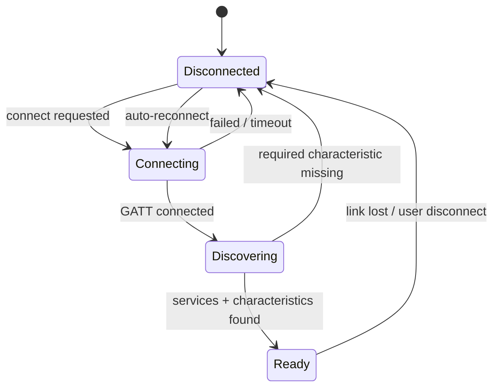

# Phase 02 — Connection Hardening

> Phase 00 connects once, by hand. This phase makes it stay connected, and come back
> on its own when it doesn't.

**Hardware:** required · **Size:** M · **Blocked by:** Phase 01

---

## Goal

A GATT connection that survives the real world: range loss, Bluetooth toggles,
treadmill power cycles, app restarts.

### Understanding what you're building (read this before the tasks)

**The everyday problem.** Think of wireless earbuds. Walk out of your phone's
Bluetooth range and the music cuts out; walk back in, and good earbuds reconnect on
their own within a couple of seconds — you never opened a settings screen. Cheap
ones don't: you have to re-open the case, or dig into Bluetooth settings and tap
the device name again. That gap between "recovers on its own" and "you have to
notice and fix it" is exactly what this phase closes. Phase 00 built
`TreadmillConnection`, and its own doc comment already says the honest thing:
*"No auto-reconnect — that is Phase 02."* Right now, walking off the side of the
treadmill deck (RSSI ≈ −49 dBm at the walking position, per the Traps section — a
real, measured number, not a guess), toggling the phone's Bluetooth, power-cycling
the treadmill, or just restarting the app all leave you back at a dead connection
with no path forward except manually reconnecting through a diagnostics screen. For
an app meant to sit untouched on a treadmill console shelf while you run, that's
not acceptable — this phase turns "connects once, by hand" into "stays connected,
and comes back on its own."

**Why not just retry immediately, forever?** The simplest-sounding fix is: the
moment `Disconnected` fires, immediately call `ConnectAsync` again, and keep
calling it in a tight loop until it works. That's *not* the approach this phase
takes, and the reason is concrete, not theoretical: GATT error 133 is already
flagged in the Traps section as "the single most common Android BLE failure," and
hammering a flaky radio stack with back-to-back connection attempts is a known way
to make that worse, not better — plus a tight retry loop burns battery retrying a
treadmill that might be powered off or out of the room for the next twenty
minutes, with the phone screen off the whole time. The schedule this phase
actually specifies — 1 s, 2 s, 4 s, 8 s, 16 s, then a steady 30 s, cancellable and
capped — is barely more code than a naive `while(true)` retry loop (it's one pure
function, `ReconnectBackoff.DelayForAttempt`, task 2.2), but it buys real
behavior: fast recovery for the common case (you walked ten feet away and came
back), and a low, sustainable retry rate for the case where the treadmill is
genuinely off for a while. Nothing here reaches for more than that — no jittered
randomization, no configurable retry policies, no circuit breaker. A static
six-step schedule is the minimum shape that avoids both "hammering" and "gives up
forever," and this project needs nothing more elaborate than that.

**The pattern, named plainly.** The schedule itself is a textbook **Retry pattern
with exponential backoff** — wait progressively longer between attempts at
something that failed, on the reasonable assumption that a transient failure often
needs a little time to clear. It isn't BLE-specific; the same idea shows up
anywhere a client depends on something unreliable (HTTP calls to a flaky server,
background sync). The cost here is genuinely small: one pure, unit-testable
function. The payoff is specific to this project: a treadmill several feet away
with a phone in your pocket will drop and regain signal routinely during a
workout, and without this, every drop would otherwise require you to stop, look at
the phone, and manually reconnect mid-run.

There's a second, quieter pattern in how `ReconnectionManager` is built: it takes
a `TreadmillConnection` in its constructor and wraps it, rather than adding retry
logic inside `TreadmillConnection.cs` itself. That's **composition over modifying
working code**, and the reasoning is Single-Responsibility-flavored:
`TreadmillConnection`'s one job is "connect once, cleanly," and that path is
already exercised by every Phase 00 screen. Bolting retry logic into the same
class means a bug in the *new* retry loop can now break the *already-proven*
connect-once path too. Keeping them as two classes — one wrapping the other —
means `ReconnectionManager` can misbehave without `TreadmillConnection` ever
knowing it exists. The tradeoff is real, not free: callers now go through one more
layer (`ReconnectionManager.State` instead of `TreadmillConnection.State`
directly), and that layer has to remember to forward events it didn't originate
(see `StateChanged` re-firing in the skeleton). For a class this small, wrapping
is worth that one extra layer of indirection; it would be overkill for, say, a
one-line utility method with no meaningful "known-working path" to protect.

## Learning goals

- **Composition over modifying working code.** `TreadmillConnection.cs`'s own doc
  comment says *"No auto-reconnect — that is Phase 02"* — you'll build the reconnect
  policy as a class that *owns* a `TreadmillConnection` rather than editing Phase 00's
  file in place, so a bug in the reconnect loop can never break the connect-once path
  every other screen already depends on.
- **Exponential backoff** as a general pattern, not a BLE-specific trick — you'll meet
  it again anywhere a client talks to something unreliable (HTTP retries, sync
  services). See the Retry pattern doc below.
- **`CancellationTokenSource`/`CancellationToken`** for a cancellable background loop
  — the same cooperative-cancellation idea `PeriodicTimer` used in Phase 01b's sample
  loop, applied here to "stop retrying" instead of "stop sampling."
- **Where code belongs, again.** The backoff *delay sequence* ("given attempt N, how
  long do I wait?") has no BLE or MAUI dependency, so it's worth pulling into `Core`
  and giving a real xUnit test, even though the class that uses it can't get one
  without an Android target — same test Phase 01b used ("does this reference
  MAUI/Android at all?").
- New vocabulary for `docs/learning/02-Glossary.md` as you hit it this phase:
  "exponential backoff," "GATT 133."

## Reference docs

- `../../05-FTMS-Protocol.md` §8 connection sequence
- `../../00-Project-Plan.md` — GATT 133 mitigations
- `../phase-00-probe-app/PHASE-00-FINDINGS.md` — Part E resilience results, MAC and
  address type
- **Preferences** — https://learn.microsoft.com/en-us/dotnet/maui/platform-integration/storage/preferences
  — a simple on-device key/value store; task 2.1 uses it to remember the last device.
- **`CancellationTokenSource`** — https://learn.microsoft.com/en-us/dotnet/api/system.threading.cancellationtokensource
  — the mechanism task 2.3's backoff loop uses to be "cancellable... no orphaned
  timer," per the Tests table below.
- **Retry pattern (exponential backoff)** — https://learn.microsoft.com/en-us/azure/architecture/patterns/retry
  — not MAUI-specific, but this project's 1/2/4/8/16/30 s schedule is exactly this
  pattern; worth reading *why* it exists, not just copying the numbers.
- **Plugin.BLE (`dotnet-bluetooth-le`) repository** — https://github.com/dotnet-bluetooth-le/dotnet-bluetooth-le
  — check `IAdapter` for a reconnect-by-known-device method before deciding whether
  task 2.3 rescans or reconnects directly.

---

## Features

- Connect / disconnect
- **Remember last device** in `Preferences` — by MAC, **unless** Phase 00 found a
  random resolvable address, in which case match by name and fix
  `UX_Device_MacAddress` in `../../14-Database.md`
- Auto-reconnect with exponential backoff: 1 s, 2 s, 4 s, 8 s, 16 s, then 30 s steady.
  **Cancellable and capped** — do not retry forever with the screen off
- Connection state surfaced to the UI
- Production scan filter fixed to whichever of `0x1826` / `FS-` prefix Phase 00 proved
  works. **Ship one, not both**, and document why in `../../DEVICE.md`

## Step-by-step

Seven tasks, roughly in build order. 2.1–2.2 are small and self-contained; 2.3 is the
real logic task (teach-don't-code applies); 2.4–2.6 extend it; 2.7 is UI, written in
full per the collaboration model.

### 2.1 — Remember the last device

1. Open `../../DEVICE.md`'s "BLE identity" table and check the **Address type** row.
   If it says `public`, MAC is a stable key — use it as primary. If it says `random
   resolvable` (or is still `NEEDED` when you reach this task), match by advertised
   name instead (`FS-9F4235`-style), per the note already in `../../14-Database.md`
   next to `UX_Device_MacAddress` — and store both fields regardless, so you're not
   blocked either way.
2. Create `src/MyHi.Companion/Features/Bluetooth/LastDevicePreferences.cs` — a small
   static class wrapping [`Preferences.Default`](https://learn.microsoft.com/en-us/dotnet/maui/platform-integration/storage/preferences),
   a simple on-device key/value store (think `localStorage` if you've used that) —
   exactly the right size for "which device to reconnect to," no database round-trip
   needed.
3. Two methods: `Save(string macAddress, string? name)` (writes both under two string
   keys, e.g. `"lastDeviceMac"` / `"lastDeviceName"`) and `(string? Mac, string? Name)
   Load()` (reads them back — `Preferences.Default.Get(key, defaultValue)` returns the
   default when never set, so no null-checking gymnastics on your end).
4. Call `Save` once `TreadmillConnection.ConnectAsync` reaches `Ready`. Today that
   happens in `ScanViewModel.ConnectAsync`
   (`src/MyHi.Companion/Features/Bluetooth/ScanViewModel.cs`) — add the call right
   after the existing `await _connection.ConnectAsync(SelectedDevice.NativeDevice);`
   line.
5. `Load()` gets called from `ReconnectionManager` (task 2.3) on app start, to know
   which device to look for.

### 2.2 — Pull the backoff schedule into a pure, testable function

`ReconnectionManager` itself (task 2.3) depends on Plugin.BLE and `TreadmillConnection`
— both app-project concepts — so it can never get a plain xUnit test without an
Android target. The *delay sequence* has no such dependency. Pull it out first.

1. Create `src/MyHi.Companion.Core/Bluetooth/ReconnectBackoff.cs` — a new `Bluetooth/`
   folder in `Core`, alongside the existing `Ftms/`, `Capture/`, `Data/`.
2. Shape:
   ```csharp
   namespace MyHi.Companion.Core.Bluetooth;

   /// <summary>
   /// Pure backoff-delay calculator: attempt 1 -> 1s, 2 -> 2s, 3 -> 4s, 4 -> 8s,
   /// 5 -> 16s, 6 and beyond -> 30s steady. No BLE, no MAUI — testable without
   /// Android.
   /// </summary>
   public static class ReconnectBackoff
   {
       public static TimeSpan DelayForAttempt(int attemptNumber)
       {
           // TODO: attempts 1-5 double from 1s (1,2,4,8,16); attempt 6+ holds at 30s.
           // attemptNumber < 1 is a caller bug — throw ArgumentOutOfRangeException.
       }
   }
   ```
3. Create `src/MyHi.Companion.Tests/Bluetooth/ReconnectBackoffTests.cs` with a
   `[Theory]` covering attempts 1 through 5 against the exact schedule, plus attempt 6
   and attempt 20 both returning 30 s — this is the "Backoff schedule" row in the
   Tests table below.
4. `dotnet test src/MyHi.Companion.Tests` — green, including every earlier phase's
   tests (regression).

### 2.3 — Build `ReconnectionManager`

**Concept.** `TreadmillConnection` knows how to connect once and tear down cleanly.
Nothing in it decides *when* to try again. That decision — watch for an unrequested
disconnect, wait per `ReconnectBackoff`, try again, give up cleanly on cancel — is a
new class that sits in front of `TreadmillConnection`, not a change to it.

**Spec.**

- File: `src/MyHi.Companion/Features/Bluetooth/ReconnectionManager.cs`.
- Constructor takes `TreadmillConnection`, `ILogger<ReconnectionManager>`, and
  whatever you decide in step 2 below for finding the remembered device (a `BleScanner`
  reference is the simplest starting point).
- Exposes `ConnectionState State => _connection.State;` and its own
  `event EventHandler<ConnectionState>? StateChanged` that re-fires whenever the
  inner `TreadmillConnection.StateChanged` does — so anything watching this class
  never has to also watch the class underneath it.
- A `bool _userInitiatedDisconnect` flag, set `true` for the duration of your own
  `DisconnectAsync()` wrapper and `false` otherwise — this is what tells the
  `Disconnected` handler "don't reconnect, the user asked for this."
- On an *unrequested* `Disconnected`, starts the backoff loop; on `Ready`, stops it
  (success ends the loop).
- The backoff loop is cancellable: a `CancellationTokenSource? _backoffCts` field,
  recreated each time the loop starts, cancelled by `DisconnectAsync()` and `Dispose()`.
- **Design decision, yours to make**: how does the loop find the device to reconnect
  to? Plugin.BLE's `IAdapter` may expose a reconnect-by-known-device method (check the
  repo linked above) — if so, use `LastDevicePreferences.Load()`'s MAC to build the
  right identifier and skip scanning entirely. If not, fall back to a short filtered
  scan (task 2.6 decides the filter) for the remembered MAC or name and connect to the
  first match. Either is defensible; write a one-line comment saying which you picked
  and why, same as Phase 01b's target-speed-after-Start decision.

Skeleton — shape only, not the working loop:

```csharp
namespace MyHi.Companion.Features.Bluetooth;

/// <summary>
/// Owns the "stay connected" policy on top of <see cref="TreadmillConnection"/>,
/// which only knows how to connect once. See docs/learning/02-Glossary.md for
/// "exponential backoff" if this is your first time meeting the term.
/// </summary>
public sealed class ReconnectionManager : IDisposable
{
    private readonly TreadmillConnection _connection;
    private readonly ILogger<ReconnectionManager> _logger;
    private CancellationTokenSource? _backoffCts;
    private bool _userInitiatedDisconnect;

    public ReconnectionManager(TreadmillConnection connection, ILogger<ReconnectionManager> logger)
    {
        _connection = connection;
        _logger = logger;
        _connection.StateChanged += OnInnerStateChanged;
    }

    public ConnectionState State => _connection.State;

    public event EventHandler<ConnectionState>? StateChanged;

    private void OnInnerStateChanged(object? sender, ConnectionState state)
    {
        StateChanged?.Invoke(this, state);

        if (state == ConnectionState.Disconnected && !_userInitiatedDisconnect)
        {
            // TODO: cancel any previous backoff loop, then start a new one
        }
        else if (state == ConnectionState.Ready)
        {
            // TODO: the loop succeeded (or was never needed) — cancel it if running
        }
    }

    private async Task RunBackoffLoopAsync(CancellationToken ct)
    {
        // TODO: attempt = 1, 2, 3, ...
        //   delay = ReconnectBackoff.DelayForAttempt(attempt)
        //   await Task.Delay(delay, ct)
        //   find the device (see the design decision above), try _connection.ConnectAsync
        //   on success: return: on failure: attempt++, loop again
        //   let OperationCanceledException from Task.Delay/ConnectAsync propagate — the
        //   caller that cancelled ct already knows it's stopping the loop
    }

    public async Task DisconnectAsync()
    {
        _userInitiatedDisconnect = true;
        _backoffCts?.Cancel();
        await _connection.DisconnectAsync();
        _userInitiatedDisconnect = false;
    }

    public void Dispose()
    {
        _connection.StateChanged -= OnInnerStateChanged;
        _backoffCts?.Cancel();
        _backoffCts?.Dispose();
    }
}
```

**Register it** in `MauiProgram.cs`: `builder.Services.AddSingleton<ReconnectionManager>();`
right after the existing `TreadmillConnection` registration — same reasoning (one
reconnect policy per running app).

**Review checkpoint**: before task 2.7's UI wiring, walk through the state machine
diagram below with the agent against your actual code — does every transition in the
diagram have a corresponding line in `OnInnerStateChanged`/`RunBackoffLoopAsync`?

### 2.4 — Confirm the GATT 133 mitigations are still in force

Not new code — `TreadmillConnection.ConnectAsync` is about to get called repeatedly
(by the backoff loop) instead of once by hand, so it's worth re-checking the Phase 00
mitigations still hold.

1. Open `src/MyHi.Companion/Features/Bluetooth/TreadmillConnection.cs` and confirm
   three things are still true: `ConnectAsync` passes `autoConnect: false` on
   `ConnectParameters` (around line 69); there's a `Task.Delay(200, ct)` between
   connecting and `GetServicesAsync` (around line 81); `DisconnectAsync` disposes the
   `IDevice` after `DisconnectDeviceAsync` in its `finally` block (around line 137) —
   this is the "`close()` before reconnecting" mitigation, since Plugin.BLE's
   `IDevice.Dispose()` is what actually closes the underlying `BluetoothGatt` on
   Android.
2. If GATT 133 shows up during the resilience tests below despite all three, treat it
   as empirical (per the Traps section) — record what changed it in `../../DEVICE.md`,
   don't assume the first mitigation you try is *the* fix.

### 2.5 — Re-issue Request Control after reconnect

**Concept.** The Traps section already states the rule: the control point (`0x2AD9`)
forgets who has control across a GATT disconnect. A reconnect that silently leaves
"Start"/"Set Speed" enabled in some future UI is a bug, even though no such UI exists
yet outside the Phase 00 diagnostics console — write the mechanism now, prove it later.

1. Inject `ControlPointClient` into `ReconnectionManager` alongside
   `TreadmillConnection` (already registered as a singleton from Phase 00).
2. Track a `bool _hadControl` flag, set from `ControlPointClient.HasControl` at the
   moment a disconnect is detected.
3. After a successful reconnect (state reaches `Ready`) where `_hadControl` was true,
   re-find the `0x2AD9` characteristic from `_connection.Services` — the same lookup
   `ControlConsoleViewModel.EnterAsync` already does
   (`src/MyHi.Companion/Features/Diagnostics/ControlConsoleViewModel.cs`, lines 76–79)
   — call `BindAsync` again, then `RequestControlAsync()`.
4. This has nowhere to prove itself end-to-end until a real control screen exists
   (Phase 03/05) — that's fine, the mechanism belongs here per the Traps section;
   revisit it at that phase's review checkpoint.

### 2.6 — Fix the production scan filter

1. Open `../phase-00-probe-app/PHASE-00-FINDINGS.md`, verdict **V4**. "Yes" (0x1826 in
   the advertisement) means `ScanFilterMode.ServiceUuid`; "no" means
   `ScanFilterMode.NamePrefix`.
2. In `ReconnectionManager`, wherever it scans to find the remembered device (task
   2.3's design decision), set `BleScanner.FilterMode` explicitly to that value —
   don't leave it at the diagnostics `Picker`'s default, and never use `Off` on this
   path. `ScanPage` keeps all three modes for debugging; this is the one place the
   choice is hardcoded for real use.
3. Record the decision and its evidence in `../../DEVICE.md`'s "BLE identity" table
   (the `0x1826 in advertisement?` row) — a sentence is enough, e.g. "Confirmed
   present in the Phase 00 capture; production scan filters on 0x1826."

### 2.7 — Surface connection state in the UI

The monochrome theme's "conveying state without color" pattern
(`docs/learning/04-Monochrome-Theme.md`) is built for exactly this: a filled-vs-outline
circle for connected/not, no second hue. This is UI code — written in full below, per
the collaboration model in `../README.md`.

1. In `src/MyHi.Companion/Features/Shared/HomeViewModel.cs`, inject
   `ReconnectionManager`, add `[ObservableProperty] private ConnectionState
   connectionState;` initialised from `reconnectionManager.State`, and subscribe to
   its `StateChanged` event in the constructor. `TreadmillConnection`/
   `ReconnectionManager` don't promise UI-thread marshalling the way `ITreadmillService`
   will (that guarantee belongs to the seam, per its doc comment) — wrap the property
   assignment in `MainThread.BeginInvokeOnMainThread(() => ConnectionState = state);`
   to be safe.
2. Add this converter to `src/MyHi.Companion/Features/Shared/Converters.cs`:
   ```csharp
   /// <summary>True only when Ready — drives the filled-vs-outline connection dot.</summary>
   public sealed class ConnectionStateToConnectedConverter : IValueConverter
   {
       public object Convert(object? value, Type targetType, object? parameter, CultureInfo culture) =>
           value is ConnectionState.Ready;

       public object ConvertBack(object? value, Type targetType, object? parameter, CultureInfo culture) =>
           throw new NotSupportedException();
   }
   ```
   and register it in `src/MyHi.Companion/App.xaml`, next to the other converters:
   ```xml
   <shared:ConnectionStateToConnectedConverter x:Key="ConnectionStateToConnectedConverter" />
   ```
3. Add this indicator near the top of `src/MyHi.Companion/Features/Shared/HomePage.xaml`,
   above the existing destinations `CollectionView`:
   ```xml
   <Grid ColumnDefinitions="Auto,Auto" ColumnSpacing="8" HorizontalOptions="Center" Margin="0,0,0,12">
       <Grid Grid.Column="0" WidthRequest="12" HeightRequest="12">
           <Ellipse Stroke="{AppThemeBinding Light={StaticResource ColorBorderLight}, Dark={StaticResource ColorBorderDark}}"
                    StrokeThickness="1.5" Fill="Transparent" WidthRequest="12" HeightRequest="12" />
           <Ellipse Fill="{AppThemeBinding Light={StaticResource ColorTextPrimaryLight}, Dark={StaticResource ColorTextPrimaryDark}}"
                    WidthRequest="12" HeightRequest="12"
                    IsVisible="{Binding ConnectionState, Converter={StaticResource ConnectionStateToConnectedConverter}}" />
       </Grid>
       <Label Grid.Column="1" Text="{Binding ConnectionState}" Style="{StaticResource Caption}" VerticalOptions="Center" />
   </Grid>
   ```
   A filled dot means `Ready`; an outline-only dot means anything else
   (`Disconnected`/`Connecting`/`Discovering`) — no color, per the theme. The `Label`
   just prints the enum's name via its default `ToString()` — good enough here; a
   friendlier label ("Reconnecting in 4s…") is a Phase 03 dashboard concern, not this
   one.
4. Build, run, and toggle phone Bluetooth off/on (one of the Tests rows below) —
   watch the dot flip from filled to outline and back.

## Connection state machine



**This machine is independent of the workout state machine** (Phase 04). Both run
concurrently. A single combined diagram cannot express "connection lost mid-workout",
which is the most likely real failure.

---

## Traps

- **GATT error 133** is the single most common Android BLE failure and is generic
  enough to mean almost anything. Known-helpful mitigations: always `close()` the
  `BluetoothGatt` before reconnecting (not just `disconnect()`); use
  `autoConnect: false` on the first attempt; put ~200 ms between connect and
  `discoverServices()`.
  *Expect 133 to occur; treat which mitigation fixes it as empirical.*
- Discovering services immediately on connect fails on some stacks. Delay.
- Never issue GATT operations from arbitrary threads. Serialise.
- **No bond handling.** Bonding is confirmed not required.
- On reconnect, **re-issue `Request Control`** before re-enabling any control UI.
- RSSI at the walking position is ≈ −49 dBm. **Any disconnect here is a software
  problem, not a radio one** — do not go looking for antenna explanations.

---

## Tests

| Test | Expected | |
|------|----------|---|
| Connect | Reaches `Ready` within 10 s | `[HUMAN]` |
| Disconnect | Clean teardown, no leaked GATT | `[HUMAN]` |
| Walk out of range and return | Auto-reconnects | `[HUMAN]` |
| Toggle phone Bluetooth off/on | Recovers to `Ready` | `[HUMAN]` |
| App restart | Reconnects to remembered device | `[HUMAN]` |
| Treadmill power-cycled | Reconnects once powered on | `[HUMAN]` |
| Hold connection 30 min idle | No spontaneous drop | `[HUMAN]` |
| Backoff schedule | Unit test the delay sequence and the cap | |
| Cancel mid-backoff | Stops immediately, no orphaned timer | |

## Acceptance

- [ ] Connects on 10 of 10 attempts
- [ ] Recovers from all four disruption tests
- [ ] Backoff is capped and cancellable
- [ ] Scan filter choice documented in `../../DEVICE.md` with the evidence
