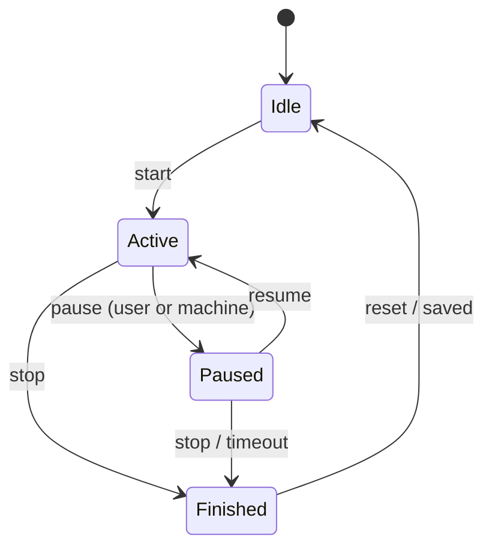

# Phase 04 — Workout Engine

**Hardware:** none for development · **Size:** M · **Blocked by:** Phases 01, 03
**Hard dependency:** V1 counter semantics from `../phase-00-probe-app/PHASE-00-FINDINGS.md`

---

## Goal

Workout lifecycle, **independent of connection lifecycle**.

## Workout state machine

Runs concurrently with the Phase 02 connection state machine. They are separate on
purpose: one diagram cannot express "connection lost mid-workout", which is the
failure most likely to actually happen.

---

## Connection-loss policy

On connection loss during `Active`: transition to `Paused` and start a **60-second
grace timer**. Restored within the window → resume. Not restored → `Finished`, saving
whatever was recorded.

**The gap must be represented explicitly in the sample series** — write a gap marker
(`WorkoutSample.Flags` bit 0), do not interpolate across it. Charts must show a break
rather than a fabricated straight line.

---

## Counter semantics — read V1 before writing any code here

| V1 verdict | What the engine does |
|------------|----------------------|
| **Per-session** | Record reported values directly |
| **Cumulative** | Every workout value is a delta against the value captured at workout start. The engine must detect a mid-workout counter reset (value decreases) and re-baseline |
| **Mixed** | Per-field handling, exactly as recorded in V1 |

**Do not guess.** Guessing wrong makes every stored workout wrong, silently, forever.

Also note: `DurationSeconds` in the schema is **active** time, excluding pauses. If the
treadmill's elapsed-time counter includes paused time, the app tracks active time
itself.

---

## Machine-initiated transitions

Drive from `0x2ADA` events where Phase 00 proved the device emits them:

| Event | Engine response |
|-------|-----------------|
| `StoppedByUser` / `PausedByUser` | Pause or finish accordingly |
| `StartedByUser` | Resume from `Paused` |
| `StoppedBySafetyKey` | **Hard stop. Never attempt to restart over BLE.** |
| `ControlPermissionLost` | Disable controls, re-request control |

If Phase 00 found the device emits nothing on `0x2ADA`, infer state from `0x2ACD`
speed values instead — workable but less precise. Record that in `../../ASSUMPTIONS.md`.

**Do not drive workout state from `0x2AD3` Training Status.** Many budget machines
report a single value permanently.

---

## Tests

- Every state transition exercised, **including illegal ones** — they must be rejected,
  not crash
- Connection loss during `Active` → grace → resume
- Connection loss during `Active` → grace expiry → `Finished` with data saved
- Gap marker written at the right elapsed second
- Counter re-baselining, if V1 was cumulative: feed a decreasing counter and assert the
  workout total stays monotonic
- `[HUMAN]` Press pause on the treadmill itself; the app reflects it via `0x2ADA`

## Acceptance

- [ ] No illegal state reachable
- [ ] Connection loss never loses more than the grace window
- [ ] Gaps appear as breaks, never as interpolated lines
