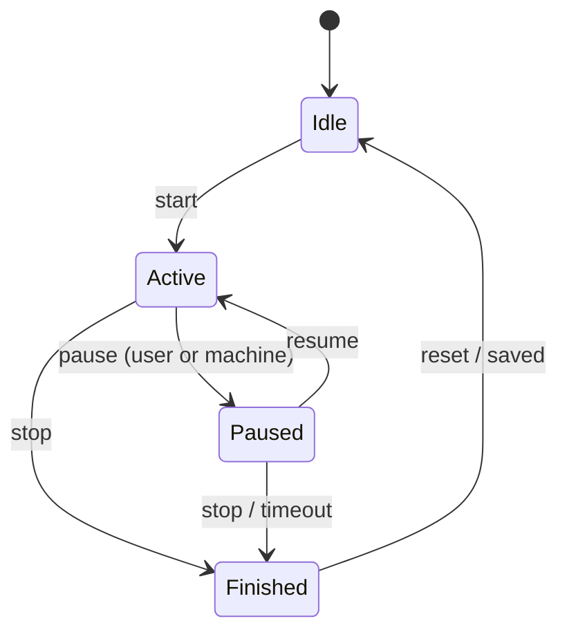

# Phase 04 — Workout Engine

**Hardware:** none for development · **Size:** M · **Blocked by:** Phases 01, 03
**Hard dependency:** V1 counter semantics from `../phase-00-probe-app/PHASE-00-FINDINGS.md`

> See `../README.md` for the collaboration model. **This entire phase is logic**: a
> state machine, some event handlers, one `[ObservableProperty]` on an existing
> ViewModel. All of it follows the "you write it, the agent teaches" track. There
> is no new XAML in this phase. It surfaces onto the dashboard Phase 03 already built,
> through a ViewModel property, and ViewModels are explicitly on the "you write it"
> side of the division of labour in `../README.md`, even though pages/XAML are not.

---

## Goal

Workout lifecycle, **independent of connection lifecycle**.

### Understanding what you're building (read this before the tasks)

**The everyday problem.** `WorkoutEngine` tracks two separate things at once: what
stage the workout is at (warming up, mid-set, resting, done) and whether the app
can currently see the treadmill over Bluetooth. Those are genuinely different
facts. Losing the Bluetooth link for a few seconds doesn't cancel the workout, it
just means the app can't currently confirm what's happening, so it waits a beat
before assuming the session is over. And when a counter value comes in, the engine
needs to know whether it's "this session" or "since the treadmill powered on":
get that wrong and every number logged afterward is wrong, confidently and
silently.

Its own state (`Idle`/`Active`/`Paused`/`Finished`) is deliberately a separate
concept from `ITreadmillService.ConnectionStateChanged` (Phase 02's connection
state: `Connecting`/`Discovering`/`Ready`/`Disconnected`). The engine subscribes
to connection events but tracks its own state independently, bridging the two
only through `WorkoutPauseReason.ConnectionLost`. The 60-second grace timer in
task 4.2 is the "wait a beat before assuming it's over" instinct, coded as a
cancellable `Task.Delay`. The counter-semantics block (task 4.3) is the "don't log
a number whose units you don't know" problem, blocked by design on
`PHASE-00-FINDINGS.md` V1.

**Why not simpler.** Three places here where a flatter design looks tempting, and
each one is worth naming why it loses.

First: why not one combined enum instead of two state machines, say a single
`WorkoutState` with a `Disconnected` value bolted on? Because connection state and
workout state don't actually vary together: you can be `Idle`+`Ready` (connected,
not started), `Active`+`Disconnected` (mid-workout, radio dropped), even
`Finished`+`Ready` (done, still connected). Cramming five connection values
against four workout values into one enum means naming and reasoning about a
combinatorial grid, most of whose cells never happen. Two small, orthogonal
machines with one explicit bridge field (`WorkoutPauseReason`) is less total
surface than one bloated one.

Second: why not skip the grace timer and end the workout the instant the
connection drops? Because BLE drops transiently and often (walking past a
microwave, the phone rotating in a pocket) for a second or two, not because the
session is actually over. Ending the workout on every blip would make the app
unreliable at the one thing it exists to do: keep a workout running while you walk
on a treadmill. 60 seconds and one `CancellationTokenSource` is cheap for that
much real-world tolerance.

Third, and different in kind from the other two: the counter-semantics decision
isn't a complexity tradeoff at all. There's no "simpler" version that's also
correct. Guessing (say, defaulting to per-session because that's more common)
doesn't fail loudly the way a malformed BLE packet does; it produces a plausible,
wrong number that gets written to SQLite and stays wrong forever, because nothing
about a wrong-but-plausible distance value looks broken. That's why task 4.3 says
stop, not "guess and revisit." There's no cheap version of "guess correctly" to
fall back to.

**The pattern, named plainly.** Keeping the workout and connection state machines
separate is an application of **separation of concerns** to state design
specifically: each machine only has to be provably correct against its own small
diagram (the tests in this phase check illegal `WorkoutState` transitions in
isolation, never a connection concern), rather than one sprawling machine where a
bug in connection-handling can corrupt workout logic that has nothing to do with
it. The cost is real: two mental models running concurrently, and one bridging
field (`WorkoutPauseReason`) that has to be kept honest by hand. It's worth it
here because the two concerns fail independently in the real world (a workout can
be perfectly fine while Bluetooth misbehaves, and the reverse isn't even
meaningful). It would **not** be worth it for a feature with only one plausible
failure mode. If this app only ever ran against a wired, unloseable connection,
bolting a `Disconnected` value onto `WorkoutState` directly would be the more
honest, simpler design, and splitting it in two would be exactly the kind of
complexity Metz would push back on.

## Learning goals

- Building a second state machine that runs concurrently with Phase 02's connection
  state machine, and *why* they're kept separate rather than merged into one diagram.
  A connection drop mid-workout can't be expressed cleanly as a single state.
- Subscribing to an interface's events from a plain `Core` class that isn't a
  ViewModel. `WorkoutEngine` subscribes to `ITreadmillService.SampleReceived`,
  `MachineEventReceived`, and `ConnectionStateChanged` the same way
  `FakeTreadmillService`'s eventual consumers will. The engine is just another
  consumer of the seam.
- A cancel-and-restart timer built on `CancellationTokenSource`. The grace window in
  task 4.2 is the first place this project uses that pattern; Phase 05's tap-debounce
  reuses the identical shape, so understanding it here pays off twice.
- Designing methods that reject illegal calls by returning `false` instead of
  throwing, the same philosophy `ITreadmillService`'s `ControlResult` return values
  already use for control-point failures.

## Reference docs

- `src/MyHi.Companion.Core/Treadmill/ITreadmillService.cs`: the events and types
  this phase consumes (`SampleReceived`, `MachineEventReceived`,
  `ConnectionStateChanged`, `MachineEventKind`, `TreadmillSample`)
- `../../05-FTMS-Protocol.md` §5: `0x2ADA` op codes, which `MachineEventKind`
  decodes them into
- `../../14-Database.md`: the `WorkoutSample` table, specifically the `Flags` bit-0
  gap marker this phase's output feeds (Phase 06 does the actual SQLite write) and
  the `DurationSeconds` "active time excludes pauses" rule
- `../phase-00-probe-app/PHASE-00-FINDINGS.md` V1: counter semantics. **Read this
  before writing any code in task 4.3.**
- **C# events**: [Events (C# Programming Guide)](https://learn.microsoft.com/en-us/dotnet/csharp/programming-guide/events/).
  Read this before touching `WorkoutEngine`'s event subscriptions if Phase 01b's
  read of it didn't stick.
- **`CancellationTokenSource`**: [CancellationTokenSource Class](https://learn.microsoft.com/en-us/dotnet/api/system.threading.cancellationtokensource),
  the mechanism behind the grace timer in task 4.2
- **`[ObservableProperty]` / `[RelayCommand]`**: [MVVM source generators overview](https://learn.microsoft.com/en-us/dotnet/communitytoolkit/mvvm/generators/overview),
  needed for task 4.6's ViewModel wiring
- **xUnit**: https://xunit.net/docs/getting-started/netcore/cmdline

---

## Workout state machine



Runs concurrently with the Phase 02 connection state machine. They are separate on
purpose: one diagram cannot express "connection lost mid-workout", which is the
failure most likely to actually happen.

### Task 4.1 — `WorkoutState` and the `WorkoutEngine` skeleton

Creates: `src/MyHi.Companion.Core/Workout/WorkoutState.cs`,
`src/MyHi.Companion.Core/Workout/WorkoutEngine.cs`.

Concrete steps:

1. Create the folder `src/MyHi.Companion.Core/Workout/`. Same "does this reference
   MAUI?" test from Phase 01b decides this: the engine only touches
   `ITreadmillService` types, none of which are MAUI-flavoured, so it belongs in
   `Core` and gets real xUnit tests.
2. In `WorkoutState.cs`, define the four-value enum from the diagram above:
   `Idle`, `Active`, `Paused`, `Finished`.
3. In the same file, define `WorkoutPauseReason { UserRequested, MachineRequested,
   ConnectionLost }`. You need to know *why* you're paused to decide later whether a
   machine-initiated resume applies or a grace-timer expiry does.
4. In `WorkoutEngine.cs`, write the class shape below. The constructor takes
   `ITreadmillService` and subscribes to its three events immediately. That's the
   same "subscribe in the constructor" pattern you'll see everywhere
   `ITreadmillService` is consumed.
5. Implement `TryStart` / `TryPause` / `TryResume` / `TryStop` for the **legal**
   transitions only, straight from the diagram. Each checks `State` first and
   returns `false` without changing anything if the call is illegal. This is exactly
   what the "illegal transitions are rejected, not crashes" test in the Tests section
   below is checking.
6. Leave `OnConnectionStateChanged`, `OnMachineEventReceived`, and `OnSampleReceived`
   as stubs for now; tasks 4.2, 4.3, and 4.4 fill them in one at a time.

The shape, not the implementation:

```csharp
namespace MyHi.Companion.Core.Workout;

public enum WorkoutState
{
    Idle,
    Active,
    Paused,
    Finished
}

public enum WorkoutPauseReason
{
    UserRequested,
    MachineRequested,
    ConnectionLost
}

public sealed class WorkoutEngine
{
    private readonly ITreadmillService _treadmill;
    private WorkoutPauseReason? _pauseReason;
    private CancellationTokenSource? _graceTimerCts;

    public WorkoutState State { get; private set; } = WorkoutState.Idle;

    public event EventHandler<WorkoutState>? StateChanged;
    public event EventHandler<WorkoutSampleRecord>? SampleRecorded;

    public WorkoutEngine(ITreadmillService treadmill)
    {
        _treadmill = treadmill;
        _treadmill.ConnectionStateChanged += OnConnectionStateChanged;
        _treadmill.MachineEventReceived += OnMachineEventReceived;
        _treadmill.SampleReceived += OnSampleReceived;
    }

    public bool TryStart()
    {
        // TODO: legal only from Idle. Set the workout-start baseline (task 4.3),
        // transition to Active, raise StateChanged.
        return false;
    }

    public bool TryPause(WorkoutPauseReason reason)
    {
        // TODO: legal only from Active.
        return false;
    }

    public bool TryResume()
    {
        // TODO: legal only from Paused.
        return false;
    }

    public bool TryStop()
    {
        // TODO: legal from Active or Paused. Cancel any running grace timer (4.2).
        return false;
    }

    private void OnConnectionStateChanged(object? sender, ConnectionStateChangedEventArgs e)
    {
        // TODO — task 4.2
    }

    private void OnMachineEventReceived(object? sender, MachineEvent e)
    {
        // TODO — task 4.4
    }

    private void OnSampleReceived(object? sender, TreadmillSample sample)
    {
        // TODO — tasks 4.3 and 4.5
    }
}

/// <summary>
/// One row of workout telemetry, produced while Active. Phase 06 buffers and
/// flushes these into WorkoutSample.
/// </summary>
public sealed record WorkoutSampleRecord(
    int ElapsedActiveSeconds,
    double? SpeedKph,
    double? DistanceMeters,
    int? Calories,
    int? HeartRate,
    bool IsConnectionGap);
```

7. Build `Core` to confirm it compiles so far:
   ```powershell
   dotnet build src/MyHi.Companion.Core/MyHi.Companion.Core.csproj
   ```

---

## Connection-loss policy

On connection loss during `Active`: transition to `Paused` and start a **60-second
grace timer**. Restored within the window → resume. Not restored → `Finished`, saving
whatever was recorded.

**The gap must be represented explicitly in the sample series**: write a gap marker
(`WorkoutSample.Flags` bit 0), do not interpolate across it. Charts must show a break
rather than a fabricated straight line.

### Task 4.2 — Grace timer

Fill in `OnConnectionStateChanged`.

Concrete steps:

1. On `e.State == ConnectionState.Disconnected` while `State == WorkoutState.Active`:
   call `TryPause(WorkoutPauseReason.ConnectionLost)`, then start a 60-second timer.
2. Use a `CancellationTokenSource` you can cancel early if the connection comes back.
   That's the same cancel-and-restart shape Phase 05's tap debounce reuses, so it's
   worth getting comfortable with it here first. Store the token source in a field so
   a reconnect (or a second disconnect) can cancel the previous one.
3. On `e.State == ConnectionState.Ready` while `_pauseReason == ConnectionLost`:
   cancel the grace-timer token, then call `TryResume()`.
4. If the delay completes **without** being cancelled (60 s passed with no
   reconnect), call `TryStop()`. That's "expiry → `Finished`, saving whatever was
   recorded" from the policy above.
5. `Task.Delay` is the mechanism, the token source is the cancel-early handle:
   ```csharp
   private async void StartGraceTimer()
   {
       _graceTimerCts?.Cancel();
       var cts = new CancellationTokenSource();
       _graceTimerCts = cts;
       try
       {
           await Task.Delay(TimeSpan.FromSeconds(60), cts.Token);
           // TODO: not cancelled -> TryStop()
       }
       catch (TaskCanceledException)
       {
           // reconnect happened first — nothing to do
       }
   }
   ```
   (`async void` is normally avoided in this project. It's used here only because
   this is a fire-and-forget timer with no caller waiting on it. Flag it at review if
   it feels wrong; it's a narrow, deliberate exception.)
6. While paused for `ConnectionLost`, don't try to emit a `SampleRecorded` for every
   missed second. Phase 06 writing a single row with `IsConnectionGap = true` at the
   elapsed second where the drop happened is enough to make the chart show a break.
   Don't backfill.

---

## Counter semantics — read V1 before writing any code here

| V1 verdict | What the engine does |
|------------|----------------------|
| **Per-session** | Record reported values directly |
| **Cumulative** | Every workout value is a delta against the value captured at workout start. The engine must detect a mid-workout counter reset (value decreases) and re-baseline |
| **Mixed** | Per-field handling, exactly as recorded in V1 |

**Do not guess.** Guessing wrong makes every stored workout wrong, silently, forever.

Also note: `DurationSeconds` in the schema is **active** time, excluding pauses. If the
treadmill's elapsed-time counter includes paused time, the app tracks active time
itself.

### Task 4.3 — Baseline and re-baselining

Fill in the counter-handling part of `OnSampleReceived`.

Concrete steps:

1. Open `../phase-00-probe-app/PHASE-00-FINDINGS.md` and read the V1 verdict. If it's
   still blank, **stop here**. This phase has a hard dependency on it, same rule
   `05-FTMS-Protocol.md` states everywhere: never invent a value for a `TBD`.
2. If **per-session**: `WorkoutSampleRecord.DistanceMeters` / `Calories` are just
   `sample.DistanceMeters` / `sample.Calories`, passed through unchanged.
3. If **cumulative**: in `TryStart`, capture the current sample's raw distance and
   calories into private baseline fields (e.g. `_distanceBaselineMeters`). Every
   subsequent sample's recorded value becomes
   `sample.DistanceMeters - _distanceBaselineMeters`.
4. Re-baseline detection: if a new sample's **raw** distance is *less than* the
   previous raw distance, the counter reset mid-session. Add the previous raw maximum
   into a running offset before subtracting the new baseline, so the recorded value
   stays monotonically increasing across the reset. It must never jump backward in
   a stored workout.
5. `ElapsedActiveSeconds` is **not** `sample.ElapsedSeconds`. Track active seconds
   yourself (increment once per accepted sample while `State == Active`), per the
   `DurationSeconds` note above: the treadmill's own elapsed-time counter may include
   paused time, which this schema explicitly excludes.

---

## Machine-initiated transitions

Drive from `0x2ADA` events where Phase 00 proved the device emits them:

| Event | Engine response |
|-------|-----------------|
| `StoppedByUser` / `PausedByUser` | Pause or finish accordingly |
| `StartedByUser` | Resume from `Paused` |
| `StoppedBySafetyKey` | **Hard stop. Never attempt to restart over BLE.** |
| `ControlPermissionLost` | Disable controls, re-request control |

If Phase 00 found the device emits nothing on `0x2ADA`, infer state from `0x2ACD`
speed values instead. Workable but less precise. Record that in `../../ASSUMPTIONS.md`.

**Do not drive workout state from `0x2AD3` Training Status.** Many budget machines
report a single value permanently.

### Task 4.4 — Wire `MachineEventReceived`

Fill in `OnMachineEventReceived`.

Concrete steps:

1. `switch` on `e.Kind` against the table above.
2. `StoppedBySafetyKey` is the one line in this whole phase that isn't a normal state
   transition: call `TryStop()` and nothing else. Do not attempt any kind of
   auto-restart in response. See `ITreadmillService.StartAsync`'s doc comment for
   why ("never call this without a deliberate on-screen user action").
3. `ControlPermissionLost` doesn't change `WorkoutState` at all. It's Phase 05's
   concern (disable speed controls, re-request control). Leave a
   `// handled in Phase 05` comment at this exact spot so it reads as a deliberate
   boundary, not a gap.
4. If Phase 00's findings show this device emits **nothing** on `0x2ADA` during a
   session, add an entry to `../../ASSUMPTIONS.md` (with this phase's number, the
   effort to resolve, and the fallback: infer `Active`/`Paused` from whether
   `sample.SpeedKph` is zero for several consecutive samples) rather than silently
   doing nothing.

### Task 4.5 — Gap markers in the sample series

Fold this into `OnSampleReceived` alongside task 4.3:

1. While `State == Active` and not currently paused for a connection loss, raise
   `SampleRecorded` with `IsConnectionGap = false` on every accepted sample.
2. The **one** exception is the sample immediately after a `ConnectionLost` pause
   resolves (either by resuming or by `TryStop()` at grace-timer expiry): raise
   exactly one `WorkoutSampleRecord` with `IsConnectionGap = true` for the elapsed
   second the drop was first detected, so Phase 06's persistence layer has something
   concrete to set `WorkoutSample.Flags` bit 0 on.
3. This is the whole of what this phase owes Phase 06: a stream of
   `WorkoutSampleRecord`s. Phase 06 owns buffering and the actual SQLite write
   (`14-Database.md`'s "buffer, flush every 30–60 s" strategy). Don't build that
   here.

---

## Task 4.6 — Surface workout state on the dashboard

This is the one place this phase touches something Phase 03 built, and it's still
logic, not UI. See the note at the top of this file.

Concrete steps:

1. Open the dashboard ViewModel Phase 03 built (check `Features/Dashboard/` for its
   actual file name; the phase list above calls it "Live Dashboard" but you may have
   named the file differently).
2. Add a constructor parameter `WorkoutEngine workoutEngine`, and register
   `WorkoutEngine` as a singleton in `MauiProgram.cs`, same reasoning as
   `TreadmillConnection`'s existing registration: one workout in progress at a time,
   for the whole app.
3. Add `[ObservableProperty] private WorkoutState workoutState;` and subscribe to
   `workoutEngine.StateChanged` in the constructor, setting the property from the
   handler.
4. The actual XAML is a single line:
   `<Label Text="{Binding WorkoutState}" Style="{StaticResource Caption}" />` added
   to the dashboard page you already have. That's small enough not to warrant its own
   task; flag it at the review checkpoint if you'd like the agent to place it
   precisely rather than doing it yourself.

---

## Tests

Creates: `src/MyHi.Companion.Tests/Workout/WorkoutEngineTests.cs`.

Concrete steps:

1. One `[Theory]` (or several `[Fact]`s) covering every edge in the state diagram,
   **including the illegal ones**: e.g. `TryPause()` called from `Idle` must return
   `false` and leave `State == Idle` unchanged, not throw.
2. Using `FakeTreadmillService` (Phase 01b): start a workout, fire a disconnect,
   assert `State == Paused`; fire a reconnect within the 60 s window, assert
   `State == Active` again.
3. Same shape, but let the grace timer expire. Inject a shorter grace period for
   tests (a constructor parameter defaulting to 60 s is the simplest way) rather than
   actually waiting a minute per test run, and assert `State == Finished`.
4. A gap-marker test: disconnect, reconnect, assert exactly one
   `WorkoutSampleRecord` in the captured sequence has `IsConnectionGap == true` and
   every other one has it `false`.
5. If V1 was cumulative: feed a sample sequence with a decreasing raw counter
   partway through, assert the recorded (baselined) distance is monotonically
   increasing across it.
6. Run everything, including regression:
   ```powershell
   dotnet test src/MyHi.Companion.Tests
   ```
7. `[HUMAN]` Press pause on the treadmill itself; the app reflects it via `0x2ADA`
   (or via the `0x2ACD` speed-inference fallback, if that's what Phase 00 found).

## Acceptance

- [ ] No illegal state reachable
- [ ] Connection loss never loses more than the grace window
- [ ] Gaps appear as breaks, never as interpolated lines
